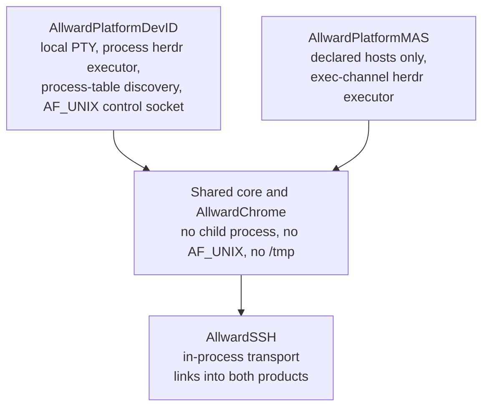

# Plan: build the sandboxed MAS product

Status: **plan only. No phase has started.** Written 2026-08-02.

This document is self-contained. Everything it cites lives in this repository.

## 1. Why this exists

Two products were accepted before the first commit.
[Decision 5](DECISIONS.md) reads:

> Dev ID (local PTY) + MAS (sandboxed, remote-only) built from day one; MAS
> *submission* deferred.

[ARCHITECTURE.md](ARCHITECTURE.md) rule 2 states the mechanism:

> **Link-time target isolation.** `AllwardLocalPTY` links only into the Developer
> ID product. The shared core remains sandbox-clean; the MAS product cannot call
> local PTY code because that code is absent from its graph.

[SPEC.md](SPEC.md) §2 states the constraint that governs every module:

> `AllwardLocalPTY` and `AllwardLocalPublisherEndpoint` are the only v1
> product-capability modules omitted from MAS; remote publishers still enter MAS
> through reverse SSH. Shared code MUST NOT assume `/tmp`, unrestricted file
> access, child-process launch, a socket family, or ssh-agent access. Platform
> services enter through injected file, credential, transport, speech, model, and
> clock interfaces.

The §15 product matrix gives MAS direct SSH, the optional multiplexer adapter,
MCP, speech, intelligence, and all v1 surfaces, and excludes `AllwardLocalPTY`,
`AllwardLocalPublisherEndpoint`, local child-process and listener code, and
their transitive dependencies.

Risk **R-02** in §17 names the failure this plan repairs: *two products from day
one; late sandbox or entitlement discovery invalidates shared code.* That
discovery has now happened. See §3.

## 2. Scope

In scope: a second application product that builds, links, and validates under
App Sandbox from the same source revision, and the shared-code changes required
to make that possible.

Out of scope, by [Decision 5](DECISIONS.md): **submission to the Mac App Store.**
The deferral covers submission only, never sandbox work or validation.

Also out of scope: any local-terminal capability in MAS. MAS is remote-only.
There is no reduced local shell, no helper that spawns one, and no offer of one
in the UI.

## 3. Measured drift

Reproduce each row from a clean checkout. Line numbers move; symbol names do not.

| Requirement | Current state | Evidence |
| --- | --- | --- |
| Two products from one revision | One application product, `allward`. The other executable, `allward-mcp`, is its helper CLI | `Package.swift`, `darwinProducts` |
| `AllwardSSH` ships in MAS | `AllwardSSH` depends on `AllwardLocalPTY`, and opens sessions by launching `/usr/bin/ssh` | `Package.swift` target list; `SSHCommandBuilder` in `Sources/AllwardSSH/SSHTransport.swift` |
| Shared code assumes no child-process launch | `HerdrProcessExecutor`, `HerdrDiscovery`, `RoomAdapters`, `ControlSocketHost` all launch processes or bind AF_UNIX, inside shared `AllwardChrome` | `grep -rl 'Process()' Sources/AllwardChrome` |
| MAS isolation manifest and four receipts | absent | no manifest file; `scripts/` has no MAS script |
| Sandboxed build exists | no | [TESTING.md](TESTING.md) known gaps |

The `AllwardSSH` row is the blocking one. MAS **must** ship direct SSH, and direct
SSH is currently built on the single module MAS forbids.

One seam is already correct and must be preserved: `HerdrSocketClient` takes an
injected `HerdrCommandExecutor`, so `AllwardHerdr` itself is sandbox-clean. Only
the concrete process-launching executor is in the wrong module.

## 4. Target architecture



Four properties define the target.

1. **`AllwardSSH` no longer depends on `AllwardLocalPTY`.** That one edge is what
   makes a MAS product impossible today.
2. **One SSH transport, in both products.** §16 fails a build on *B/C divergence*
   across the §5 SSH lifecycle cells, and the §14 per-target key boundary permits
   Dev ID and MAS to differ in their credential and host-trust **stores**, not in
   their transport. Two transport implementations would guarantee the divergence
   the gate rejects.
3. **Platform capabilities are injected, never imported.** Anything that spawns a
   process, binds a UNIX socket, reaches ssh-agent, or assumes `/tmp` moves into a
   product-specific platform module behind a protocol declared in shared code.
4. **The herdr adapter works in MAS.** Its executor becomes an SSH exec channel on
   the same connection. `HerdrEndpoint` keeps describing the command; only
   execution changes. `HerdrExecutionSite.local` has no meaning in MAS.

### Consequences worth stating plainly

- Automatic discovery of a herdr running on this machine is Dev-ID-only, because
  it reads the process table. In MAS a Room's server is **declared**, which is
  what the Settings and Board connect controls already do.
- A sandboxed product cannot read `~/.ssh/config`, so SSH host aliases defined
  there do not resolve. MAS hosts come from Allward's own configuration.
- A sandboxed product cannot reach the ssh-agent socket. MAS authenticates with
  keys the user has imported. This is OQ-14 territory and gated on decision D-B.
- One in-process connection carrying many channels replaces the current full SSH
  handshake per herdr command.

## 5. Decisions required before work starts

Two phases must not begin until the owner rules. Record each accepted decision in
[DECISIONS.md](DECISIONS.md).

**D-A - adopt an SSH library.** MAS needs direct SSH and cannot launch `ssh`, so
the protocol must run in-process. This repository has no external package
dependencies today and no decision records a policy either way, so adopting one
is a new decision rather than a departure from an existing rule. Writing an SSH
implementation instead would combine the R-01 risk (*from-scratch engine consumes
the project*) with a cryptographic attack surface, so the plan assumes a library.
The candidate is `swift-nio-ssh`: Apple-maintained, Swift concurrency native,
permissive licence, no C vendoring. It supplies the protocol only; host trust,
key import, and known-hosts policy remain ours, which §14 already assigns to us.
Blocks phase 2.

**D-B - the MAS credential route.** §14 leaves ssh-agent access, security-scoped
key-file access, and entitlements probe-gated, and OQ-14 owns the proof. The
proposal is: keys imported through the open panel and held in Keychain, host
trust on first use with fingerprint display, and no agent. Both products MUST
keep identical trust and cancellation semantics. Blocks phase 5.

## 6. Phases

Each phase lands independently and leaves the tree green.

### Phase 1 - stand up the MAS product, failing

Create the second application product and the isolation manifest that defines it,
plus the four receipts §2 requires: resolved dependency-graph exclusion, negative
compile fixtures for local PTY, local publisher, and process launch, archive
linker-map and linked-library closure, and final artifact inspection.

`scripts/no-adapter-clean-build-test.sh` is the working precedent for a
manifest-driven exclusion receipt; the MAS receipts consume their own manifest
the same way.

The product does not build at first, and that is the point: from here every
change is measured against it.

- **Accepts when:** a script emits all four receipts, and they fail loudly and
  specifically, naming `AllwardLocalPTY` reached through `AllwardSSH`.
- **Guards against:** shared code drifting further toward the Dev ID product
  while nothing checks.

### Phase 2 - in-process SSH transport (blocked on D-A)

Replace the process-launching SSH implementation behind the existing
`RemoteTransport` facade, keeping `AllwardSSH` the only module that knows the
protocol. Remove its `AllwardLocalPTY` dependency.

Both PTY channels and exec channels are required: panes need the former, the
herdr executor needs the latter.

- **Accepts when:** every §5 SSH lifecycle cell passes against a real remote host
  with unchanged goldens, and the dependency-graph receipt from phase 1 stops
  reporting `AllwardLocalPTY`.
- **Guards against:** B/C divergence, which §16 fails a build for.

### Phase 3 - move platform code out of shared modules

Introduce `AllwardPlatformDevID` and `AllwardPlatformMAS` behind protocols
declared in shared code. Relocate local PTY spawning, the process-table herdr
discovery, the process herdr executor, and the AF_UNIX control socket host into
the Dev ID module. `AllwardChrome` keeps no direct reference to any of them.

- **Accepts when:** the negative compile fixtures pass, `AllwardChrome` contains
  no process launch or socket bind, and the Dev ID product behaves identically to
  today.
- **Guards against:** the §2 shared-code prohibition being satisfied by comment
  rather than by graph.

### Phase 4 - herdr over an exec channel

Add the MAS executor: same `HerdrEndpoint` argv, executed as an SSH exec channel
on the connection the Room already holds. Dev ID keeps its process executor.
Per-Room adapter selection and the Settings and Board connect controls are
unchanged.

- **Accepts when:** a Room declared against a remote herdr server lists its
  sessions in the MAS product with no process launched, and the Dev ID product is
  unaffected.
- **Guards against:** the adapter quietly becoming Dev-ID-only, which the §15
  product matrix forbids.

### Phase 5 - credentials and host trust (blocked on D-B)

Implement the injected credential and host-trust stores for both products and
close OQ-14 with its probe fixtures: import, unlock, use, rotation, deletion,
host-key first use and mismatch, sandbox access, logs, and crash artifacts, with
throwaway keys in both products.

- **Accepts when:** OQ-14's both-target receipts pass and no private-key material
  appears in UI, config, logs, protocol messages, or crash artifacts.

### Phase 6 - archive and validate

Produce the sandboxed archive with its entitlements, run the four receipts
against the real archive rather than a build directory, and record the result.
Submission remains deferred.

- **Accepts when:** `G1-core-C` passes: the sandboxed product launches direct SSH
  and all applicable UI, MCP, and speech paths, and proves no local-terminal offer
  and no reachable `AllwardLocalPTY` or `AllwardLocalPublisherEndpoint` path.

## 7. Verification

Every phase runs on a macOS 26 machine:

```sh
swift build
swift test
bash scripts/no-adapter-clean-build-test.sh
python3 scripts/validate-publication.py
```

Phases 1 and onward add the MAS receipt script to that list. A phase is complete
when its receipts pass, not when the code compiles.

## 8. Non-goals

- Submitting to the Mac App Store.
- Any local shell, or a helper process that provides one, in MAS.
- Changing the Dev ID product's behaviour. Users of it should notice nothing
  except faster herdr polling after phase 2.
- Supporting untrusted third-party herdr servers. §14 requires a separate
  isolation threat model for that.
