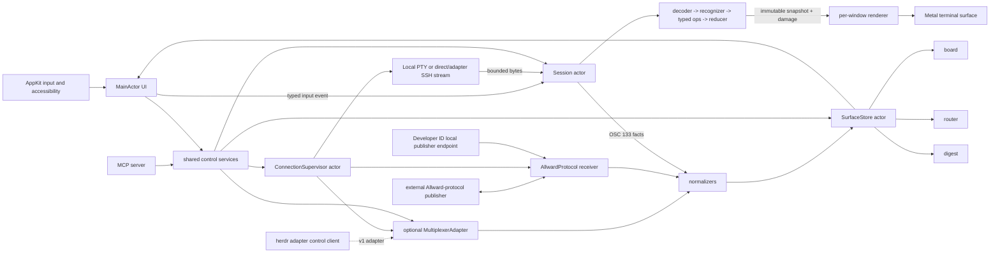
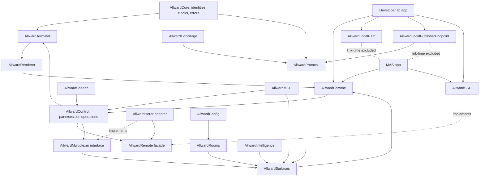
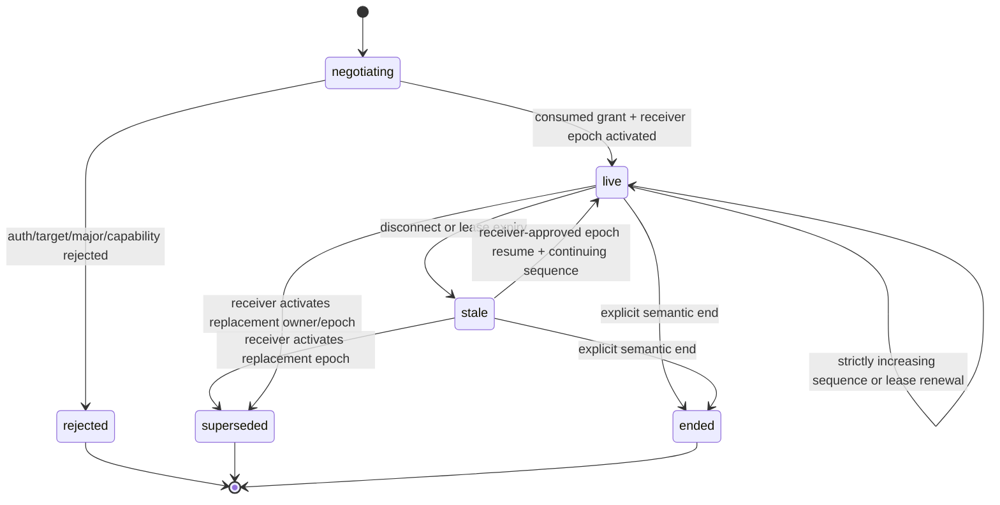
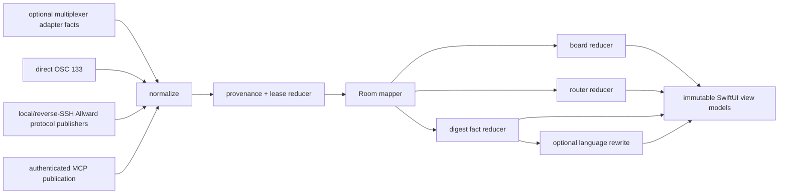
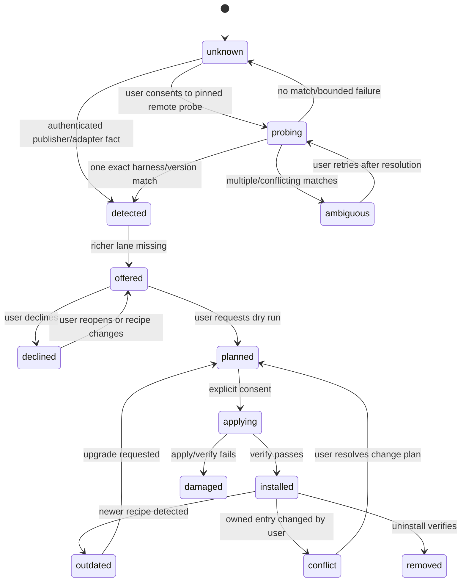
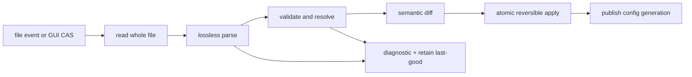

# Allward technical specification

Status: canonical Part I specification. This file owns §§1-17. `DESIGN-LANGUAGE.md` owns visual, sensory, interaction, accessibility, and design-validation requirements in §§18-25.

Allward is a complete native terminal without a multiplexer. Local PTY and direct SSH are core paths. Optional adapters add discovery and durable workspace identity; herdr is the deepest first adapter, not a runtime prerequisite.

`MUST`, `SHOULD`, and `MAY` are normative.

## 1. Product statement + ICP

Allward is a macOS 26, Swift 6, open-source terminal for an operator driving
agents across local and remote sessions. Local terminals and direct SSH are
complete product paths: terminal engine, panes/tabs/splits, OSC 133, Rooms,
MCP, STT, and Allward-protocol publisher surfaces work without a multiplexer.
Remote work is the primary organizing model; local PTYs are available only in
the Developer ID product.

Allward does not build a multiplexer. A `MultiplexerAdapter` is optional. herdr is
the first and deepest adapter and the v1 flagship integration; tmux is a 1.x
adapter. When the herdr adapter is active, herdr owns its remote PTYs,
persistence, layout, focus, and composition. herdr is not a launch, runtime, or
core-feature requirement.

The application keeps conditional authorities separate:

1. the terminal engine owns direct local and SSH byte streams;
2. an optional multiplexer adapter owns the composition and identities within
   its external workspace;
3. the herdr adapter's socket client owns herdr workspace, pane, focus, and
   coarse agent facts when that adapter is active;
4. the Allward protocol owns rich sideband agent and command state in direct and
   adapter-backed sessions.

The primary user needs to see live sessions, identify open loops, route
attention, teleport to the correct pane, and dictate text without losing
context or causing execution. Rooms separate work and personal contexts.
Neurodivergent-friendly re-entry, open-loop externalization, and divided-
attention glanceability are product requirements, not optional modes. With no
multiplexer adapter, boards, router items, todos, and digests reduce local and
direct-SSH OSC 133 plus Allward-protocol publisher records. Cross-machine
discovery uses manually configured SSH hosts and sessions until an adapter
provides discovery.

### v1 scope

Required:

- Developer ID and sandboxed MAS targets built from the first tagged build;
- a full local-terminal path in Developer ID and a full direct-SSH path in both
  products, with panes/tabs/splits, OSC 133, Rooms, MCP, STT, and protocol
  publisher surfaces independent of herdr;
- the optional herdr adapter and its remote workspace integration for the
  flagship G2 path;
- instant board, router strip, native todo surfaces, one-key teleport, and
  event-based re-entry digest;
- on-device auto-naming and bounded digest rewriting when available;
- push-to-talk dictation into any valid destination without Return;
- Apple Focus-filter integration; Dynamic Type on every native v1 surface; and
  the off-by-default four-earcon family plus settings preview, all under the
  Design Language probes and G3 receipts;
- MCP server, harness concierge, native config, and theme import.

Excluded from v1:

- an Allward multiplexer or tmux adapter;
- inline images, while preserving the image-plane seam;
- cross-container scrollback search, session hand-off UI, supervised sidecar,
  big-type ambient board, and menu-bar count; these are 1.x reserved contracts
  whose data or layout seams are preserved;
- future focus mode (distinct from v1 Apple Focus filtering), time anchors
  (never productivity scores), and notification digests; these remain roadmap,
  not dropped, with no release number assigned;
- model-generated command execution and MCP client behavior.

Every excluded/reserved item above is absent from v1 G1/G2/G3 implementation
bundles.

## 2. Architecture overview

### Process model

One long-lived app process owns UI, terminal state, connections, and surface
state. No background daemon, remote sidecar, or multiplexer adapter is required
to launch or use core terminal features. A target-specific MCP launcher/helper,
if required by OQ-11, is a narrow transport adapter and not a state owner.
Remote publishers connect through SSH-forwarded endpoints in both products.
Developer ID also exposes app-owned local publisher endpoints; MAS exposes no
local publisher listener. A later sidecar may implement the remote transport
contract without changing publisher or reducer semantics.

Ownership rules:

- One session actor exclusively owns byte ingestion, parser state, grid,
  scrollback, selection anchors, modes, and damage generations.
- MainActor owns AppKit/SwiftUI state and accessibility objects. It MUST NOT
  receive or parse terminal bytes.
- The renderer consumes immutable snapshots and MUST NOT reach into mutable
  session state.
- One connection supervisor owns each SSH connection identity and all child
  channels and forwards. Room state references a connection; it does not own
  one.
- Surface reducers accept typed normalized records only. Views MUST NOT parse
  wire messages or infer state from terminal pixels.
- Swift 6 strict concurrency is required. Escape hatches that permit shared
  mutable parser state fail G1.

### Module and target map

| Module | Deep boundary | Developer ID | MAS |
|---|---|---:|---:|
| `AllwardTerminal` | bytes and typed input in; immutable terminal snapshots out | yes | yes |
| `AllwardRenderer` | coherent snapshot and semantic design tokens in; Metal commands out | yes | yes |
| `AllwardProtocol` | publisher frames in and decision-control frames out; correlated publisher status frames in; normalized publisher records and decision receipts out | yes | yes |
| `AllwardControl` | shared typed pane/session operations, per-pane input/command arbitration, speech-injection linearization, and opaque route dispatch; native UI, MCP, and STT use the same service | yes | yes |
| `AllwardRemote` | connection, remote PTY, byte channel, control channel, endpoint-forwarding facade | yes | yes |
| `AllwardSSH` | one in-process implementation of the remote facade | yes | yes |
| `AllwardMultiplexer` | optional discovery, external workspace identities, content route, focus, and control-plane events; no-adapter implementation is valid | yes | yes |
| `AllwardHerdr` | v1 `AllwardMultiplexer` adapter: typed socket API plus compositor-channel lifecycle; optional at runtime | yes | yes |
| `AllwardRooms` | mapping and active policy snapshot | yes | yes |
| `AllwardSurfaces` | normalized records in; immutable board/router/digest snapshots out | yes | yes |
| `AllwardIntelligence` | bounded facts in; grounded label/prose out | yes | yes |
| `AllwardSpeech` | locked target plus normalized permission/analyzer/route events in; one total `SpeechTransition` and typed effects out | yes | yes |
| `AllwardMCP` | MCP requests in; shared control operations out | yes | yes |
| `AllwardConcierge` | detected harness plus consent in; owned remote change set out | yes | yes |
| `AllwardConfig` | UTF-8 TOML bytes in; validated generation out | yes | yes |
| `AllwardChrome` | native windows, boards, settings, accessibility host | yes | yes |
| `AllwardLocalPTY` | local child PTY lifecycle | yes | **absent from link graph** |
| `AllwardLocalPublisherEndpoint` | app-owned target-bound AF_UNIX receiver descriptor and listener lifecycle | yes | **absent from link graph** |

`AllwardMultiplexer` MUST define a no-adapter state rather than a null herdr
dependency. Its interface returns adapter availability and capability facts;
callers MUST NOT infer missing core terminal, Room, protocol, MCP, STT, split,
tab, or board behavior from adapter absence. The 1.x tmux adapter must be able
to enter through this seam without changing terminal or surface reducers.

### Clean-build and target isolation proofs

`AllwardNoHerdrTarget` proves optional-adapter isolation through a closed
machine-readable manifest: resolved package/target graph, compilation and core
unit result, linker map, linked libraries, and every final artifact. It omits
`AllwardHerdr`; any core herdr import/type or unlisted artifact fails. The same
manifest drives `scripts/no-adapter-clean-build-test.sh`. Config/state receipts
also cover install-enable-disable-remove-reenable and prove local/direct-SSH
sessions, Room definitions, TOML settings, and normalized surface records
survive adapter removal/re-addition without migration loss.

The MAS isolation manifest freezes forbidden modules, capabilities, APIs,
symbols, and every Mach-O, framework, library, extension, helper, and executable
inspected. It excludes `AllwardLocalPTY`, `AllwardLocalPublisherEndpoint`, local
process launch, and their target-only dependencies. Four coupled receipts
consume that same manifest on every tagged archive:

1. resolved package/target dependency graph exclusion;
2. negative MAS compile fixtures for local PTY, local publisher listener, and
   forbidden process-launch capabilities;
3. archive linker-map and linked-library closure;
4. final artifact symbol/import/dependency inspection across the manifest's
   complete artifact set.

The compile fixture proves source visibility; graph/link/archive receipts prove
artifact exclusion. A symbol/string scan alone cannot pass.

### Core window and session topology

A window owns one Room and an ordered tab set. Each tab owns an Allward split tree;
each leaf owns one pane target and one session actor. A leaf target is local
PTY, direct SSH PTY, or an optional adapter content route. Split, close, move,
focus, resize, and restoration operate on this Allward-owned tree without an
adapter. An adapter's internal layout remains opaque: a herdr workspace
compositor is one leaf terminal surface even when it contains many herdr panes.

`AllwardLocalPTY` and `AllwardLocalPublisherEndpoint` are the only v1
product-capability modules omitted from MAS; remote publishers still enter MAS
through reverse SSH. Shared code MUST NOT assume `/tmp`, unrestricted file
access, child-process launch, a socket family, or ssh-agent access. Platform
services enter through injected file, credential, transport, speech, model, and
clock interfaces.

## 3. Terminal engine

### Typed parser pipeline

1. **Ingress** accepts bounded chunks and preserves ordering for one session.
2. **Decoder** incrementally forms Unicode scalars and preserves control-byte
   meaning across chunk boundaries.
3. **Escape recognizer** recognizes ground text, C0/C1 control behavior, ESC,
   CSI, OSC, DCS, and ignored strings. Payload, parameter-count, and recovery
   bounds MUST be explicit before allocation.
4. **Operation builder** emits typed operations. It MUST NOT mutate the grid.
5. **Reducers** apply cursor, margin, mode, tab, palette, primary/alternate
   screen, title, hyperlink, and OSC 133 operations.
6. **Grapheme stage** forms grapheme clusters, calculates display width, and
   maps combining input to its lead cluster.
7. **Shaping stage** maps source cell ranges to positioned glyph references.
   The v1 implementation MAY be identity shaping, but the seam and source-cell
   mapping are real. Combining characters and color emoji MUST work before G1.
8. **Damage publisher** emits row ranges, cursor and selection changes,
   palette/geometry invalidation, and a single immutable generation.

Malformed or truncated sequences MUST return to a defined parser state within
configured bounds. A parser diagnostic MUST NOT contain unbounded terminal
content. VT bytes and Allward-protocol frames use separate decoders and corpora.

### Grid and scrollback contract

| Object | Required representation and invariant |
|---|---|
| active grid | Packed contiguous rows for fixed current geometry; primary and alternate screens have independent state. |
| cell | Grapheme reference, attribute reference, display width/continuation state, and any protection/damage state needed by the reducer. Exact packing is benchmark-selected. |
| grapheme table | Session-owned interning for multi-scalar clusters; a combining mark never becomes a selectable standalone cell. |
| attribute table | Session-owned interned styles and colors; repeated attributes do not allocate per cell. |
| logical line | Stable session-local line identifier, styled runs, hard-break/reflow metadata, and grapheme offsets. |
| scrollback | Fixed-capacity blocks of logical lines with bounded retention and allocation-free steady-state append. Block size and compression remain probe-selected. |
| selection anchor | Stable line identifier plus grapheme offset, not an array index that moves on append or reflow. |
| snapshot | Immutable generation containing current geometry, materialized viewport rows, modes, cursor, selection, and damage. |

Resize is a state transaction: resolve new geometry, reflow eligible logical
lines while preserving hard breaks and anchors, position the cursor, and
publish one coherent generation. Alternate-screen redraws do not enter normal
scrollback. Eviction removes oldest complete retention units and explicitly
invalidates only anchors whose line identifiers were evicted. The model MUST
preserve future per-session search and v1.x cross-session indexing without
requiring a second cell grid.

### Reserved image layer

Renderer snapshots include an empty image-placement collection and ordered
image plane behind glyphs. No v1 parser sequence may populate it. Kitty
graphics and iTerm2 OSC 1337 remain v1.x adapters.

### G1 conformance manifest

G1 uses a checked-in manifest containing exact upstream commit/release, case
identifier, expected result, and explicit non-goal. The manifest is frozen for
the gate. Additions require a new manifest revision; no moving upstream branch
is allowed.

| Suite | Named behavior classes to pin | Gate result |
|---|---|---|
| esctest | CUU/CUD/CUF/CUB/CNL/CPL/CHA/VPA/CUP/HVP; DECSTBM and DECOM; ED/EL/ECH; ICH/DCH/IL/DL/SU/SD | every pinned case passes |
| esctest | DECAWM including wrap-pending; wide and combining clusters; DECSC/DECRC; tabs; cursor visibility | every pinned case passes |
| esctest | SGR reset and style combinations; 16/256/truecolor; primary/alternate 47/1047/1049; OSC title and OSC 8 lifecycle | every pinned case passes |
| vttest | VT100 cursor movements and screen features; insert/delete; erase; scrolling regions; wrap/origin interaction | every selected visual section matches the recorded reference |
| vttest | keyboard/mode checks used by Allward input mapping; UTF-8, color, and alternate-screen checks present in the pinned release | every selected visual section matches the recorded reference |
| fuzz corpora | decoder, escape recognizer, operation builder, and Allward-protocol codec | zero crashes, hangs, or unbounded allocation on the pinned corpus |

Printer control, DECUDK, Tektronix, DEC locator, sixel, kitty graphics, and OSC
1337 images are explicit G1 non-goals unless the frozen manifest says otherwise.

**OPEN QUESTION OQ-01 - conformance pins.** Owner: terminal owner. Probe: import
esctest and vttest, run the named classes against a reference terminal and the
first Allward parser, then check in exact upstream revisions, case IDs, visual
fixtures, and non-goals. Gate impact: G1 cannot start without the manifest.

## 4. Renderer

### Metal scene and atlas

A terminal surface hosts one Metal layer in AppKit. SwiftUI may compose chrome
around it but MUST NOT own grid rendering. A renderer consumes one snapshot
generation and executes these ordered scene families:

1. terminal background runs and selection/search backgrounds;
2. reserved image plane;
3. monochrome glyph and RGBA color-emoji instances;
4. underline, strike, hyperlink, command-region, and other decorations;
5. cursor and finite focus indicators.

Monochrome and RGBA atlases have separate budgets and eviction. Atlas keys
include the resolved font/glyph/presentation inputs needed for correct reuse;
colors that can remain instance data MUST NOT multiply atlas entries. Misses
rasterize outside the parser and render critical paths, then damage only rows
that depend on the result. Exact atlas sizes, packing, and eviction thresholds
are measured implementation choices.

### Damage, frame pacing, and energy

- The renderer uploads only damaged instance ranges unless geometry, scale,
  palette, theme, or resource invalidation requires a full redraw.
- Multiple parser generations before one display opportunity coalesce to the
  newest coherent generation. Parser operations are never discarded.
- Input writes bypass render coalescing.
- Focused surfaces schedule frames only for damage, finite interaction, or
  finite motion. Unfocused and occluded windows render on demand.
- Cursor blink, if enabled, runs only during a finite activity window and then
  settles visible with no timer or further damage. Accessibility state MUST NOT
  depend on blink.
- **No polling rule and permitted timers:** Polling is strictly defined as
  recurring state-refresh queries used to discover state change (such as periodic
  `pane.read` calls, background grid scraping, or recurring surface state scans).
  State polling loops are forbidden. Permitted timers are strictly non-polling:
  bounded reconnect backoff deadlines, SSH transport keepalives, finite cursor
  blink timers, lease-expiration deadline timers, and bucketed UI freshness label
  update timers. Freshness label timers schedule wakeups only when a visible label
  crosses its next bucket boundary (e.g., crossing from 59s to 1m); hidden labels
  schedule zero wakeups. Permitted timers MUST NOT query terminal state, poll
  network endpoints for state, or submit GPU frames at settled idle.
- At settled idle, submitted GPU frames MUST be zero, and CPU work MUST be
  approximately zero.
- Resize MUST present either the last coherent old geometry or the first
  coherent new geometry. It MUST NOT scale an old grid, show a blank frame, or
  combine geometry generations.

`CAMetalDisplayLink` is a candidate, not a required API. macOS 26 evidence says
it supports variable-rate displays and best-effort callbacks, not guaranteed
power savings. The chosen scheduler must win the reference-hardware probe.

**OPEN QUESTION OQ-02 - frame scheduler.** Owner: renderer owner. Probe: compare
macOS 26 candidate schedulers on owner hardware with an instrumented one-grid
app. Record keypress-to-present latency, 120 Hz damaged rendering, flood
coalescing, resize generations, occluded/unfocused behavior, submitted idle
frames, CPU wakeups, and Activity Monitor idle classification. Gate impact:
selection and receipt are required for G1.

## 5. Remote layer

### Shared SSH facade and target boundary

Both products use one in-process SSH facade. It exposes only the capabilities
needed by higher modules: establish a verified connection, open a byte stream,
open a remote PTY command with geometry, open a control channel, forward an
injected endpoint, resize, cancel, and close. These are semantic capabilities,
not a commitment to a library API.

SwiftNIO SSH and libssh2 are candidates. Neither is selected until a spike
proves PTY channels, forwarding, host-key trust, credentials, cancellation,
concurrency, reconnect, Swift 6 isolation, signing, and packaging in both
products. Credential and ssh-agent behavior MUST NOT be assumed.

### Publisher receiver branches

One Allward-protocol receiver implements two product-gated transports:

| Branch | Product | Endpoint and principal | Target binding |
|---|---|---|---|
| local | Developer ID only | app-owned AF_UNIX endpoint inside an owner/container-bound runtime location, socket and descriptor mode `0600`; principal is the authenticated local OS account/container | one current descriptor and one current target credential per exact session/pane |
| reverse SSH | Developer ID and MAS | remote loopback or SSH-user-owned mode-`0600` UNIX listener forwarded remote-to-local into the app container; principal is verified host fingerprint plus remote OS account | one current descriptor/opaque selector and target credential per exact session/pane; one SSH connection may carry many target bindings |

MAS MUST NOT create or advertise a local publisher endpoint. Neither branch may
bind an unauthenticated LAN listener or assume `/tmp`. Mode `0600` and credential
possession authenticate an OS-account boundary, not a process among the same
UID. Same-UID substitution is outside v0's guarantee and MUST NOT be reported as
rejected. Principal enrollment pins receiver-verification material. Publisher
authorization separately requires the current credential for the descriptor's
exact `PublisherTargetKey` and `credential_generation`.

For each permitted target, the app atomically publishes an owner-only
`ReceiverDescriptor`. The opaque selector is receiver-issued; the publisher may
present it but may not construct or override an address. Missing, ambiguous,
expired, wrong-principal, wrong-target, wrong-credential-generation, or stale-
generation descriptors fail before grant issuance. The receiver resolves the
exact session/pane and stamps all provenance.

Publisher authorization is an exact two-phase exchange:

1. After verifying the receiver challenge, the publisher authenticates with
   the descriptor-selected target credential and sends `GrantRequest` containing
   descriptor ID, declared harness/publisher identity, protocol major/
   capabilities, directional frame kinds, and resume information. The receiver
   resolves the `PublisherTargetKey`, reserves the next ownership generation,
   records the publisher-epoch decision, and returns an unconsumed
   `PublisherGrant` carrying target key, descriptor/credential/connection/
   ownership generations, receiver nonce, expiry, identity, protocol values,
   publication kinds, and optional `permission_decisions` capability.
2. `StreamHello` proves the grant nonce and repeats every fixed value. The
   receiver validates that the target's credential generation is still current,
   then atomically consumes the grant and activates its reserved ownership/
   epoch. Exactly one concurrent hello succeeds; later use is replay. Expiry
   governs only unconsumed grants. An accepted stream remains authorized by its
   channel, exact target authority, connection/ownership generations, and
   enrollment until EOF, fencing, or target-local revocation.

There is one active ownership generation per `PublisherTargetKey`. Consuming a
grant atomically activates its reserved next generation and fences the old
stream before any frame is accepted. Grant issuance never advances ownership or
fences a stream. A hello whose reserved generation is no longer next fails
closed. The receiver alone selects whether a reconnect resumes the current
stale epoch with continuing sequence or begins a replacement epoch with reset
sequence. It atomically supersedes the old epoch and rejects every later old-
epoch/generation frame. One target transaction never advances another target's
credential, descriptor, ownership, stream, forward, or connection generation.

The reference publisher SDK watches the stable descriptor location, resolves
the descriptor before reading only its target-specific credential artifact, and
never searches for an enrollment-wide fallback. It supports startup before
listener creation, atomic descriptor replacement, connect/EOF backoff, receiver
challenge, grant exchange, stale-to-authenticated-live recovery, epoch/sequence
checkpointing, the §6 permission-decision ledger, and the §6 real-zsh binding.

Rotate and revoke use one serialized `PublisherCredentialTransaction` per
`PublisherTargetKey`; different target keys may transact concurrently:

| Phase | Rotate exact-target authority | Revoke exact-target authority | Required failure result |
|---|---|---|---|
| `preparing(tx, expected_generation)` | stage and verify one target-owned credential and unpublished descriptor; snapshot that target's grants, ownership, stream, logical forward, and artifact manifest | snapshot the same complete target-owned set; current authority remains live | cancel, staging failure, target mismatch, or CAS loss rolls back to the unchanged old authority; staged entries are removed or recorded as target-local cleanup |
| `committed(tx, next_generation)` | one receiver transaction installs the new credential/descriptor, invalidates only old-target grants, advances/fences only that target's ownership/stream, rebinds its logical forward, and journals pending artifacts | one receiver transaction writes a revoked tombstone, removes active descriptor/credential authority, invalidates grants, and fences only that target's ownership/stream/forward | commit is irreversible; post-commit artifact failure becomes `cleanup_pending`, never authority rollback |
| `cleanup_complete | cleanup_pending` | remove only verified old/staged artifacts belonging to this target/transaction | remove only verified target-owned credential/descriptor/endpoint artifacts | offline, mutated, shared, wrong-type, wrong-mode, wrong-target, or wrong-generation artifacts remain visible conflicts and are never unlinked |
| caller `outcome_unknown(tx)` | query the journal by transaction ID; return old generation or committed replacement, never both | query returns old generation or one revoked tombstone, never both | response loss never redispatches the transaction; recovery leaves one authoritative result |

`PendingCleanupRecord` and each pending artifact belong to exactly one
transaction and target key. Rotation/revocation of A MUST leave B's credential
fingerprint/reference, descriptor, grants, ownership, stream, forward, pending
artifacts, and shared `connection_generation` byte-for-byte unchanged while B
continues to normalize frames.

### Connection state machine

Canonical states remain `idle | resolving | connecting | authenticating |
ready | degraded | reconnecting | closed`. `closed` is terminal. `reconnecting`
is reachable only after `ready` or `degraded`, because
`DESIGN-LANGUAGE.md` §18.10 gives it stale/last-frame meaning; pre-ready retry
returns to `resolving` and remains loading.

`ConnectionSupervisor` computes one bounded `RetryDecision` before reduction:
`scheduled(next_attempt, max_attempts, not_before, overall_deadline)` or
`exhausted(attempt, max_attempts, overall_deadline)`. Numeric policy is frozen by
OQ-06. The reducer never invents retry eligibility. In the table, `Rpre` means
scheduled retry to `resolving`; `Rlive` means scheduled retry to
`reconnecting`; `X` means `closed/terminal_error`; `D` means
`closed/terminal_denied`; `N` means `closed/normal_closed`; `I` means an exact
state-preserving ignored result. Every cell emits one tagged reason.

| From | Success | User cancel | Bounded timeout | Retryable failure | Nonretryable failure | Trust/credential/consent denial | Explicit close | Disconnect |
|---|---|---|---|---|---|---|---|---|
| `idle` | `I(no-active-operation)` | `I(no-active-operation)` | `I(no-active-operation)` | `I(no-active-operation)` | `I(no-active-operation)` | `I(no-active-operation)` | `N(explicit-close)` | `I(no-active-operation)` |
| `resolving` | `connecting/address-resolved` | `N(user-cancelled)` | scheduled `Rpre(retrying.resolving.timeout)`; exhausted `X(retry-exhausted.resolving.timeout)` | scheduled `Rpre(retrying.resolving.failure)`; exhausted `X(retry-exhausted.resolving.failure)` | `X(nonretryable.resolving)` | `D(denied.kind)` | `N(explicit-close)` | scheduled `Rpre(retrying.resolving.disconnect)`; exhausted `X(retry-exhausted.resolving.disconnect)` |
| `connecting` | `authenticating/transport-established` | `N(user-cancelled)` | scheduled `Rpre(retrying.connecting.timeout)`; exhausted `X(retry-exhausted.connecting.timeout)` | scheduled `Rpre(retrying.connecting.failure)`; exhausted `X(retry-exhausted.connecting.failure)` | `X(nonretryable.connecting)` | `D(denied.kind)` | `N(explicit-close)` | scheduled `Rpre(retrying.connecting.disconnect)`; exhausted `X(retry-exhausted.connecting.disconnect)` |
| `authenticating` | `ready/authentication-accepted` | `N(user-cancelled)` | scheduled `Rpre(retrying.authenticating.timeout)`; exhausted `X(retry-exhausted.authenticating.timeout)` | scheduled `Rpre(retrying.authenticating.failure)`; exhausted `X(retry-exhausted.authenticating.failure)` | `X(nonretryable.authenticating)` | `D(denied.kind)` | `N(explicit-close)` | scheduled `Rpre(retrying.authenticating.disconnect)`; exhausted `X(retry-exhausted.authenticating.disconnect)` |
| `ready` | `I(already-ready)` | `N(user-cancelled)` | scheduled `Rlive(retrying.ready.timeout)`; exhausted `X(retry-exhausted.ready.timeout)` | scheduled `Rlive(retrying.ready.failure)`; exhausted `X(retry-exhausted.ready.failure)` | `X(nonretryable.ready)` | `D(denied.kind)` | `N(explicit-close)` | scheduled `Rlive(retrying.ready.disconnect)`; exhausted `X(retry-exhausted.ready.disconnect)` |
| `degraded` | remove restored capability; `ready` iff none remain, else `degraded` | `N(user-cancelled)` | scheduled `Rlive(retrying.degraded.timeout)`; exhausted `X(retry-exhausted.degraded.timeout)` | scheduled `Rlive(retrying.degraded.failure)`; exhausted `X(retry-exhausted.degraded.failure)` | `X(nonretryable.degraded)` | `D(denied.kind)` | `N(explicit-close)` | scheduled `Rlive(retrying.degraded.disconnect)`; exhausted `X(retry-exhausted.degraded.disconnect)` |
| `reconnecting` | `resolving/retry-window-open` | `N(user-cancelled)` | scheduled stay `reconnecting`; exhausted `X(retry-exhausted.reconnecting.timeout)` | scheduled stay `reconnecting`; exhausted `X(retry-exhausted.reconnecting.failure)` | `X(nonretryable.reconnecting)` | `D(denied.kind)` | `N(explicit-close)` | scheduled `I(duplicate-disconnect)`; exhausted `X(retry-exhausted.reconnecting.disconnect)` |

`connectIntent` is separately total: `idle -> resolving`; every other
nonterminal state returns `ignored.already-active`; `closed` returns
`ignored.already-closed` and requires a new connection identity. Child
`pty | control | reverse_forward | adapter_channel` failure in `ready` adds
`degraded(capability,cause)`; in `degraded` it updates only that capability;
restoration removes it and returns to `ready` only when the set is empty. Child
events in other states are `ignored.phase-mismatch`. Child retry advances only
the child generation, never `connection_generation` or unaffected children.

Every `ConnectionTransitionOutput` contains connection/operation IDs, from/to
state, generation before/after, phase attempt, retry decision, tagged reason,
bounded diagnostic code, `source_usability`, dependent-record effect,
capability/control availability, and emitted semantic transition. Reasons are
the closed families `progress | retrying | retry-exhausted | degraded |
normal-close | denied | nonretryable | ignored`. Pre-ready is `loading`;
`ready` is `live_usable`; `degraded` names only missing capabilities;
`reconnecting` marks dependents stale and disables actions; normal close is
absent; denial is denied; exhausted/nonretryable close is error. This is the
sole handoff to `DESIGN-LANGUAGE.md` §18.10 and §8.

Old-generation/operation callbacks are ignored and counted before reduction.
OQ-06 freezes `SSH-LIFECYCLE-*`: every state/event/retry-decision cell plus
never-responding, late-success-after-cancel/close, denial, child degradation,
and generation-fence goldens. Live signed-product fixtures exercise direct PTY,
control, reverse forward, trust, cancellation, close, disconnect, and reconnect
without herdr.

### Multiplexer adapter seam

`AllwardMultiplexer` is an optional capability provider layered above direct
terminal and SSH services. Its semantic contract is:

| Capability | Adapter contract | No-adapter behavior |
|---|---|---|
| discovery | emit external server/workspace/session/pane identities and revisions | use configured local sessions plus manually configured SSH hosts/session presets |
| content | open a typed content route that feeds an ordinary session actor | open local or direct-SSH PTYs through `AllwardRemote` |
| focus | resolve and request an exact external pane target | focus Allward-owned tabs, splits, and panes directly |
| control facts | normalize adapter events with revision and provenance | accept OSC 133 and Allward-protocol publisher records directly |
| health | publish adapter availability, capabilities, degradation, and stale reason | report `none`, not an error |

The core MUST NOT branch on a herdr type. It asks the interface for
capabilities and retains full terminal, pane/tab/split, Room, MCP, STT, board,
router, digest, and publisher behavior when the adapter state is `none`.
Adapter absence changes discovery and external-workspace operations only.

herdr implements this interface in v1. tmux may implement it in 1.x. An adapter
MUST NOT replace the direct-SSH path or become a prerequisite for protocol
publishers.

`AdapterRef` is an opaque pair of adapter namespace and adapter-owned identifier.
Core storage, protocol, Room, reducer, and UI contracts may compare or persist
it but MUST NOT parse vendor fields. Only the matching adapter module may
interpret its identifier or payload. The adapter publishes generic capability,
route, health, identity, revision, and provenance records at the seam.

### herdr adapter: control client

The typed adapter targets verified herdr 0.7.5, protocol 17, JSON Schema
2020-12 schema version 1. It consumes `session.snapshot`, supported
`events.subscribe` events, pane/workspace/agent state, logical input methods,
and revision-bearing rendered snapshots where applicable. Exact generated
method and type names MUST come from the pinned herdr schema, not this prose.

The adapter boundary is strict:

- `pane.read` and `agent.read` are rendered `text`/`ansi` snapshots, not raw
  inner PTY streams.
- Generic output-change subscription is not verified in protocol 17.
- Plugins are argv workflow packages. They cannot add socket methods, raw PTY
  taps, request hooks, or arbitrary events.
- Subscription events are a closed union. Allward MUST NOT infer an extension
  channel that the verified schema does not expose.
- Metadata is a compact projection only. The verified limits are at most 16
  tokens per report, 32 retained, 80 characters each, with TTL and sequence.
  Counts/current item/coarse state may use it; complete plans may not.

Server enrollment inside `AllwardHerdr` binds the verified SSH host identity to the
verified herdr server identity. `AllwardConfig` persists that relation as an
opaque namespaced `AdapterRef` plus adapter-owned payload and exposes generic
inspectable add, remove, and trust management UI. Unenrolled adapter socket
connections are rejected.

Snapshot reads use `G2-herdr-snapshot-manifest.json` only while the snapshot
fallback is active. The manifest freezes `max_age_ms`, `read_deadline_ms`,
`max_reads_per_pane_per_window`, `window_ms`, and `coalescing_window_ms`.
Exactly one trigger is required: `initial_open`, `explicit_focus`,
`manual_refresh`, `reconnect_resync`, or one OQ-05-pinned relevant event.
Each receipt records product artifact, `AdapterRef`, target, route/lease
generation, trigger, timing, revision, truncation, render commit, computed age,
freshness, coalescing, and deadline. Settled idle issues zero reads. Snapshot
axes are independent: `route_liveness=non_live` always and
`snapshot_freshness=fresh|stale`; recent never means live.

`G2-herdr-fault-manifest.json` freezes frame/field/snapshot/queue/RSS/CPU/
main-thread-p99/cancellation/duration/control-event/compositor-byte bounds. Each
signed product enrolls two independent herdr domains with distinct SSH
connections and `AdapterRef`s. The suite faults domain A's JSON-RPC and
compositor paths with flood, blocked reader/writer, cancellation, malformed/
unknown/revision-regression data, and client/server death. Degradation is keyed
to affected connection, `AdapterRef`, workspace, and content route.

Throughout every case, domain B must keep advancing frames, revisions, exact
focus/input acknowledgments, and publisher projections within its frozen bounds.
Developer ID also advances one local and one direct-SSH control session; MAS
advances two independent direct-SSH controls. All queues/tasks/resources return
to baseline after cancellation/reconnect, and no unaffected source changes
freshness.

### Routed choice: herdr-adapter rendering

**Required probe-gated primary for the herdr adapter:** run one full remote
herdr client per visible workspace under an Allward-owned SSH PTY and render its
compositor stream as one herdr compositor surface. herdr remains the layout and
focus authority inside that adapter. The independent socket client is authority
only for verified herdr workspace, pane, agent, revision, and focus facts.
`AllwardProtocol` and `AllwardSurfaces` own Rooms, todos, attention, full plans, and
teleport resolution after normalizing those facts. Allward MUST NOT reconstruct
native panes from screenshots or scrape compositor pixels for semantics.

`WorkspaceLeaseActor` owns one monotonic `interactive_lease_generation` per
enrolled herdr workspace and at most one full-client PTY. It serializes route
launch/fallback, focus, resize, keyboard, paste, mouse, STT, MCP, and transfer.
Every route task, compositor frame, focus acknowledgment, and input operation is
stamped with its generation.

Transfer/fallback increments the generation before revocation, closes admission
to the old holder, cancels/drains its queued tasks, and activates the new route
only after old final-write acknowledgments settle. The final transport write
rechecks lease generation, exact target, route state, and immediately preceding
focus acknowledgment; mismatch drops the write and fails closed. Old compositor
frames/focus acks cannot update the new view. Additional visible views consume
immutable current-generation snapshots and send no input/focus/resize.

A native external herdr client can race shared focus. Raw full-client input is
interactive only if OQ-03 proves server-enforced exclusivity or per-client focus
isolation through final write. Otherwise Allward uses a verified target-addressed
input method for the exact pane when available, or downgrades the route to
read-only. G2 delays old-generation writes/frames, changes focus from an
external client between acknowledgment and write, transfers two Allward windows,
and exercises resize, close, fallback, disconnect, and reconnect. Every accepted
byte must carry the active generation and reach only its acknowledged target.

This route selection runs only after the user selects or discovery activates a
herdr-backed workspace. The no-adapter state, local panes, and direct-SSH panes
bypass it and remain fully interactive.

| Route | Verified fact | Required use | Probe-gated boundary |
|---|---|---|---|
| full herdr client under SSH PTY | herdr has a full persistent remote UI; hidden-PTY behavior is not yet proven | primary whole-workspace compositor surface | every OQ-03 interaction/fencing case and sub-second live frame passes |
| `herdr agent attach` under owned PTY | agent-only compositor stream; non-agent pane fails; not raw inner bytes | first fallback for a known agent pane; label **agent-only** | OQ-04 bidirectional input, takeover, reconnect, resize, fencing, and timing pass |
| `pane.read` | point-in-time rendered snapshot with revision/truncation metadata; no raw or live stream | non-live read-only recovery; persistent **Read-only snapshot**, provenance, revision, truncation, freshness, and manual refresh | both-product snapshot manifest/corpus pass; input, live-route, and flagship eligibility remain false |
| ordinary SSH terminal running herdr | ordinary interactive terminal path | final fallback with herdr UI but no native control-plane synchronization | independent per-product `G2-herdr-ordinary-ssh` proves launch, target/input, resize, reconnect, exact label, negative native board/focus/teleport claims, and cleanup |

The exact fallback ladder within the herdr adapter is mandatory:

```mermaid
stateDiagram-v2
    [*] --> fullProbe
    fullProbe --> fullClient: OQ-03 passes
    fullProbe --> agentProbe: any required case fails
    fullClient --> agentProbe: runtime route failure
    agentProbe --> agentOnly: known agent + OQ-04 passes
    agentProbe --> snapshotRead: otherwise
    agentOnly --> snapshotRead: attach/runtime failure
    snapshotRead --> snapshotFresh: admissible revision within max age
    snapshotRead --> snapshotStale: deadline/malformed/regression with retained frame
    snapshotRead --> ordinarySSHConnecting: socket/read unavailable
    snapshotFresh --> snapshotStale: max age expires; zero reads
    snapshotFresh --> snapshotRead: allowlisted trigger
    snapshotStale --> snapshotRead: allowlisted trigger
    snapshotStale --> ordinarySSHConnecting: socket/read unavailable
    ordinarySSHConnecting --> ordinarySSHLive: PTY + herdr launch succeeds
    ordinarySSHConnecting --> routeError: bound fails/cancelled
    ordinarySSHLive --> ordinarySSHReconnecting: disconnect
    ordinarySSHReconnecting --> ordinarySSHLive: reconnect succeeds
    ordinarySSHReconnecting --> routeError: bound fails/cancelled
    fullProbe --> closed: explicit close/cancel
    agentProbe --> closed: explicit close/cancel
    snapshotRead --> closed: explicit close/cancel
    snapshotFresh --> closed: explicit close/cancel
    snapshotStale --> closed: explicit close/cancel
    ordinarySSHConnecting --> closed: explicit close/cancel
    ordinarySSHLive --> closed: explicit close/cancel
    ordinarySSHReconnecting --> closed: explicit close/cancel
```

Snapshot states deny keyboard, paste, mouse, STT injection, MCP mutation, and
queued input. They retain the last admissible frame; regression/malformed output
cannot replace it or reset freshness. Only allowlisted triggers read; age expiry
does not. `ordinarySSHLive` permits ordinary terminal input but fixes
`native_sync=false`, keeps `DESIGN-LANGUAGE.md` §23.3's exact persistent label,
and exposes no native board/focus/teleport claim. `routeError` creates no fifth
route. Route changes are explicit and generation-fenced.

No route may poll, scrape compositor pixels, or claim raw inner OSC 133.
A flagship-selected route MUST prove `live_stream=true` plus the native
discovery/focus/teleport capabilities the demo uses. Snapshot is non-live;
ordinary SSH is unsynchronized; neither is flagship-eligible. Each signed
product whose artifact contains this four-route ladder MUST pass its own
`G2-herdr-ordinary-ssh` result regardless of selected primary. The result
qualifies recovery only and cannot satisfy the flagship demo.

If herdr is absent or the user did not configure its adapter, none of these
states runs. Local and direct-SSH sessions continue through their normal
terminal paths.

**OPEN QUESTION OQ-03 - full-client route.** Owner: remote/herdr owner. G2
probe on disposable 0.7.5 workspaces covers every primary boundary, lease
generation/transfer/final-write fencing, delayed old traffic, external native
client focus race, exclusivity/per-client isolation or target-addressed
alternative, reconnect, and sub-second coherent frame. Record bytes, focus
acknowledgments, generations, timings, and screens. Blocks
`G2-herdr-adapter`.

**OPEN QUESTION OQ-04 - agent fallback.** Owner: remote/herdr owner. G2 probe
covers known/non-agent panes, bidirectional input/takeover, lease generations,
delayed old writes, resize, reconnect, and second-client observation. The route
is unavailable until this case passes.

**OPEN QUESTION OQ-05 - herdr revision/event behavior.** Owner: herdr adapter
owner. G2 freezes 0.7.5 revision/event/snapshot/truncation/scrollback/ANSI
behavior and `G2-herdr-snapshot-manifest.json` freshness, deadline, rate, and
coalescing bounds. Both products run initial-open, idle-age, manual-coalescing,
verified/unverified-event, deadline, regression, reconnect, truncation, and
read-unavailable cases. Blocks the per-product snapshot and adapter rows.

**OPEN QUESTION OQ-06 - SSH implementation, lifecycle, and echo fixture.**
Owner: remote owner. Candidate facades run the frozen total §5 lifecycle/output
manifest in signed Developer ID and sandboxed MAS products, then live remote
PTY, control, forward, trust, cancel, close, disconnect, reconnect, and
generation-fence fixtures against a real container. Before echo measurement,
freeze topology, LAN RTT/jitter window, sample count, workload, capture method,
and numeric maximum added p99; run baseline and Allward under that fixture. G1
requires one selected implementation plus both-product lifecycle/echo receipts.
The same selected implementation and lifecycle oracle block each product's
`G2-herdr-ordinary-ssh`.

## 6. Allward protocol v0

### Purpose and wire boundary

The Allward protocol exchanges publisher state and correlated receiver-to-publisher
permission decisions for agents and shells Allward did not spawn. It reuses the
pinned infinitty socket grammar and adds a session dimension and bidirectional
decision frames. infinitty-omp remains the reference client; Allward does not fork
infinitty. Exact framing and field spelling MUST come from a pinned reference
commit and golden corpus.

The transport is address-agnostic. A receiver-issued descriptor location is
injected by environment or consented configuration. Publishers MUST NOT assume
`/tmp`, socket/TCP shape, container path, or target address. Developer ID may
use local AF_UNIX or reverse SSH; MAS uses reverse SSH only.

### Semantic envelope

| Envelope field | Owner and required meaning | Validation |
|---|---|---|
| protocol major + capabilities | publisher declaration in `GrantRequest`, frozen onto accepted stream | unsupported major/required capability rejects only this stream; unknown optional in-major frame is ignored and counted |
| harness + publisher identity | declaration authenticated to the exact `PublisherTargetKey` | mismatch with consumed grant fails closed |
| descriptor + target + credential generation | receiver-issued/resolved before grant | absent, ambiguous, stale, cross-target, publisher-constructed, or noncurrent value fails before attach |
| connection + ownership generations + publisher epoch | receiver-selected and channel-bound | every frame from another generation/epoch is rejected before normalization |
| publication sequence | publisher-monotonic within the active epoch | duplicate/lower sequence or reset without new epoch is ignored and counted |
| publisher publication kind + payload | publisher assertion | kind must be direction/grant-allowed; payload size/depth/count checked before normalization |
| receiver decision kind + binding | receiver assertion under `permission_decisions` | decision ID, request/option, record, target, descriptor/connection/ownership generation, and epoch must match current actionable source before serialization |
| publisher decision status + ordinal | publisher assertion under the same transaction | binding and monotonic status ordinal/transition must validate before the decision ledger changes |
| lease request | publisher assertion negotiated to a receiver-bounded lease | receiver monotonic clock decides freshness |
| receiver-stamped provenance | receiver only, source-discriminated as defined above | any reserved provenance/address/source field in a payload is rejected |
| AdapterRef | receiver only, derived from an enrolled adapter association | publisher-supplied adapter references are rejected |

Publication frames assert sequence, lease, kind, and payload under their fixed
channel identity/target. Decision-control frames use the transaction binding
below and never borrow publication sequence. All provenance is stamped after
authentication. Unknown optional in-major frames are source-local no-ops, never
app-wide failures.

### ACP vocabulary and Allward additions

ACP supplies data shapes, not Allward transport or lifecycle. Schema versions are
vendored and named by capability.

| Reused ACP shape family | Allward use | Authority |
|---|---|---|
| plan entries | open-loop items and todo state | publisher within its epoch |
| session updates | agent lifecycle, current activity, and progress facts | publisher within its epoch |
| permission requests | explicit approval/needs-input records with bounded `permission_request_id` and unique `option_id` | publisher within its epoch; option identity never derives from display text |

| Allward-owned sideband addition | Reason |
|---|---|
| receiver target and publisher epoch | fences external-session incarnations without exposing adapter types |
| command-region lifecycle | carries A/B/C/D, exit, cwd, and receiver command ID where supported |
| lease, sequence, stale reason, provenance | supports disconnect/expiry without deletion or spoofing |
| Room hint | publisher mapping proposal only |
| attention class and local router acknowledgment | local deterministic routing only; local acknowledgment emits no protocol frame and never mutates publisher permission |
| `PermissionDecisionTransaction` | interoperable receiver decision dispatch, publisher commit authority, recovery, and acknowledgment |
| compact-projection/future-continuity relations | relates rich/coarse state and reserves later hand-off without carrying terminal content |

The protocol MUST NOT carry terminal-content byte streams, publisher-selected
colors/sounds/view code, or Room authority.

### Permission decision transaction

On an actionable option, the receiver durably mints opaque `decision_id` and
monotonic `decision_generation`, then freezes:

`(decision_id, decision_generation, permission_request_id, option_id,
normalized_permission_record_id, permission_record_sequence,
PublisherTargetKey, descriptor_id, descriptor_generation,
connection_generation, publisher_ownership_generation, publisher_epoch)`.

`actionable_epoch_id`, MCP `invocation_id`, digest tokens, and command IDs are
not decision identity. Both ends recheck the complete tuple at their final
admission boundary.

| Frame | Direction | Required effect |
|---|---|---|
| `PermissionDecisionRequest` | receiver -> publisher | First valid ID/fingerprint creates the publisher ledger; an identical duplicate returns status without handler re-entry; same ID with changed bytes is collision and fails closed. |
| `PermissionDecisionStatus` | publisher -> receiver | Echoes the full binding, monotonic `status_ordinal`, state, and typed receipt; only a valid transition changes the receiver ledger. |
| `PermissionDecisionCancel` | receiver -> publisher | Competes atomically with the publisher commit boundary; never starts another transaction. |
| `PermissionDecisionQuery` | receiver -> publisher | On a currently authenticated same-target stream, reads durable status only and never invokes the handler/effect. |
| `PermissionDecisionOutcomeAck` | receiver -> publisher | Names final state, ordinal, and canonical status digest; confirms receiver durability only. |
| `PermissionDecisionAcknowledged` | publisher -> receiver | Echoes the exact final state/ordinal/digest and an ack receipt; preserves the final outcome and never promotes it. |

```mermaid
stateDiagram-v2
    [*] --> ready
    ready --> dispatching: persist + send request once
    ready --> cancelled: source/revoke/cancel before serialization
    dispatching --> accepted: publisher durably admits before handler
    dispatching --> rejected: binding/policy/option rejection
    dispatching --> cancelled: cancel wins boundary
    dispatching --> outcome_unknown: possible delivery; response unavailable
    accepted --> committed: irreversible effect + effect receipt
    accepted --> rejected: handler rejects before boundary
    accepted --> cancelled: cancellation wins boundary
    accepted --> outcome_unknown: effect cannot be proved
    outcome_unknown --> accepted: query
    outcome_unknown --> committed: query
    outcome_unknown --> rejected: query
    outcome_unknown --> cancelled: query
    committed --> acknowledged: ack round-trip
    rejected --> acknowledged: ack round-trip
    cancelled --> acknowledged: ack round-trip
    outcome_unknown --> acknowledged: unknown outcome acknowledged
```

`accepted` is durable admission, not success. Only
`committed(effect_receipt)` may make the correlated permission `granted`.
`acknowledged(final_outcome, ordinal, ack_receipt)` is an overlay that preserves
the final outcome. Rejected, cancelled, unknown, transport acceptance,
publisher acknowledgment, and local router acknowledgment never grant.

The reference SDK persists the fingerprint and `accepted` before one harness
callback. One cancellation-aware commit primitive arbitrates: cancel-first
persists cancelled and enters no effect; boundary-first closes cancellation,
runs the effect once, then persists committed; rejection persists rejected with
zero effect; an unprovable post-boundary crash persists outcome unknown. Duplicate
requests and queries never enter the callback. Status ordinal regression is
ignored/counted; same ordinal with different bytes fails closed.

Before serialization, the source must remain live/actionable with current
option, target, descriptor, connection, ownership, and epoch. After dispatch,
stale/error/close removes approval controls but retains the transaction receipt.
Same-epoch reconnect uses query only. Replacement ownership/epoch or permission
record makes old results historical; a new choice mints a new decision ID.
Revocation blocks new dispatch, cancels only provably pre-boundary work,
preserves commit, and maps an unobservable race to outcome unknown. Once a
request may have arrived, response loss never authorizes redispatch.

OQ-07 fixtures `PDT-001` through `PDT-018` cover committed/rejected/cancelled/
acknowledged paths, both cancel/commit schedules, response loss, publisher crash,
wrong target, stale generation, reconnect query, replacement epoch, revoke
before/after acceptance/commit, duplicate/collision, local-ack isolation,
permission-record replacement, ordinal/ack correlation, and receiver restart.
Each records frame order, both ledgers, handler/effect count, normalized
permission, router epoch, and UI/AX result in Developer ID local/reverse SSH and
MAS reverse SSH with adapter `none`.

### Receiver-owned effective-subject precedence

Publishers assert only a typed semantic key within their grant-bound target.
They may propose a compact/rich association but never establish one. The
receiver's `EffectiveSubjectReducer` validates the proposal against enrolled
`AdapterRef`, exact target, adapter identity facts, and publisher identity, then
issues an immutable effective-subject ID and association generation. Every
surface reducer consumes its winner output, not raw competing records.

| Rich state | Coarse live | Coarse stale | Coarse absent |
|---|---|---|---|
| absent | coarse live | coarse stale | no winner |
| live | rich live; coarse shadowed | rich live; coarse shadowed | rich live |
| stale | coarse live, labeled fallback | rich stale, coarse shadowed | rich stale |
| ended | rich tombstone suppresses preexisting coarse; completion remains digest-eligible | same | same |
| superseded | coarse live | coarse stale | no winner |

An adapter/coarse transition received after an ended tombstone can establish a
new association generation; an older/equal transition cannot resurrect it. A
replacement rich epoch is evaluated independently of the superseded epoch.
Matched values are never summed. Winner/source/provenance changes without a
semantic value transition do not allocate a digest ordinal or earcon.

The G2 same-subject golden trace covers coarse live -> rich live -> rich stale
with coarse fallback -> rich reconnect -> rich ended/tombstone -> later coarse
new generation -> rich superseded/replacement. Each step freezes winner,
shadow/tombstone state, board/router/digest/todo counts, provenance, freshness,
receiver ordinal behavior, and no-double-count result.

`plan item` and `todo` are disjoint normalized kinds with disjoint stable-ID
spaces and counts. OQ-07's vendored ACP mapping pins one field-based rule that
assigns every source record to exactly one kind. Reducers never merge, alias, or
deduplicate kinds by text/title. One logical item published in both forms yields
two records with independent lifecycles; completing one never mutates the other.
Dual-form goldens require exactly two rows and exact per-kind counts;
contradictory completion emits one digest fact for the completed kind only.

### Lease state machine

Lease duration/renewal bounds come from the frozen protocol resource manifest.
Freshness is `live | stale | ended | superseded`; permission/action expiry is
separate (`active | expired | dismissed | granted | denied`). Receiver epoch
activation is ordered by accepted ownership-generation transaction, never
numeric/lexical publisher input or arrival race. Sequence resets only with a
new receiver epoch. Expired permissions remain inspectable but non-actionable;
disconnect never invents completion/deletion.

Permission-record freshness/expiry and `PermissionDecisionTransaction` phase
are orthogonal. Stale/superseded source state removes actionability but never
erases or rewrites a durable decision result.

### Three-lane semantic degradation

The install ladder is independent of optional multiplexers and content routes.
Lane 0 always exists. v1 shell support is evidence-bound to real interactive
zsh only; Bash, fish, and other shells are unsupported/open until versioned
real-shell probes pass.
`ShellRecipeDetector` keys detection by exact host, enrolled account, and resolved login shell, then requires a fresh interactive `$ZSH_VERSION` proof before offering the zsh recipe. Harness detection is a separate lane and is never a prerequisite for the shell offer.

| Lane | Install cost | Sources | Guaranteed semantics | Missing semantics and behavior |
|---|---|---|---|---|
| 0 - core/zero install | none | local/direct-SSH sessions and native OSC 133; connected Allward publishers; optional adapter facts | configured sessions/panes, direct command regions, source/freshness, and adapter parity when configured | without an adapter, no automatic external workspace discovery |
| 1 - zsh shell regions | one consented line in the enrolled account's resolved `${ZDOTDIR:-$HOME}/.zshrc` | reference-SDK interactive-zsh binding over Allward protocol plus literal OSC 133 on the shell PTY | A/B/C/D command regions, cwd, exit, and shell freshness | no harness plans/permissions; Bash/fish disclose unsupported and change no file |
| 2 - rich harness | one consented shim per harness | ACP-shaped Allward-protocol publications | plans, updates, permissions, rich board/router/digest inputs | no claim for shapes the harness lacks |

The canonical owned zsh line is exactly:

`[[ -r "${XDG_DATA_HOME:-$HOME/.local/share}/Allward/shell/v1/Allward.zsh" ]] && source "${XDG_DATA_HOME:-$HOME/.local/share}/Allward/shell/v1/Allward.zsh" # Allward-managed:shell:zsh:v1`

Ownership is the byte-exact full line plus versioned payload/manifest artifacts
whose path, hash, owner, mode, and preimage are in the host+account ledger.
Marker-substring matches are not owned. Detect/plan are pure and show host/
account, resolved rc path, preimage hash, payload hash/version, and exact diff.
Only consent bound to that plan may apply/remove through preimage CAS and atomic
same-directory replacement while preserving unrelated bytes/owner/mode.
Symlink/non-regular input, changed preimage, duplicate exact lines, modified
marker, or payload mismatch is conflict with zero writes. Reapply is a verified
no-op with exactly one line. Remove deletes only byte-identical owned material;
a missing line is idempotent success. Fresh-zsh verification proves removal;
already-running sourced shells may remain active until exit.

| Installer state/event | Exact result |
|---|---|
| detect non-zsh | `unsupported`; disclose `Shell integration is unsupported for <shell> in Allward v1; no files changed. Lane 0 remains available.` |
| absent/removed -> request install | `plannedInstall`; zero writes and one exact plan |
| plannedInstall -> decline | prior absent/removed state; zero writes |
| `plannedInstall` -> consent with matching preimage | `applying -> installed` after the owned line and payload are atomically written, ledgered, and byte/hash verified; no publication is required for `installed`; write/verify failure is `damaged` with rollback/owned-artifact receipt |
| `installed` -> first fresh interactive zsh with one hook registration and one SDK stream | `active`; the stream target, shell instance, recipe version, and freshness match the install ledger |
| `installed`/`active` -> repeat install | same state with `changed=false` and exactly one marker |
| any ownership/preimage collision | `conflict`; no file or payload change |
| `installed`/`active`/`damaged` -> request remove -> consent | `plannedRemove -> removing -> removed` after exact owned-line/artifact removal and fresh-shell silence |
| absent/removed -> remove | `removed(changed=false)` |

The zsh command reducer is `idle -> A(prompt start) -> B(input start) ->
C(command executing) -> D(command finished, exact exit) -> A`. Stable identity
is `(receiver-stamped target, shell_instance_id, command_counter)`; phase is not
identity. A/C and cwd-change frames carry canonical cwd; D carries exit. Hooks
capture `$?` before another command, register once, ignore re-entry, and never
fabricate D before C. The SDK checkpoints current command/last acknowledged
phase. Disconnect makes sideband stale while local OSC continues; approved
resume retransmits only an unacknowledged phase, while replacement epoch sends
one current-state snapshot. Both produce one logical command/D/digest result.

Direct/local raw PTY fixtures observe literal OSC A/B/C/D and SDK sideband.
For herdr compositor routes, verified v0.7.5 path
`src/protocol/wire.rs FrameData -> src/server/render_stream.rs prepare_frame ->
src/protocol/render_ansi.rs BlitEncoder` has no OSC-133 semantic field and
reconstructs cells rather than inner bytes. The adapter's outer stream must
therefore contain zero forwarded inner OSC 133; the reference SDK sideband is
the sole command-semantic source.

**OPEN QUESTION OQ-07 - protocol, transport, SDK, and resource manifest.**
Owner: protocol owner. Pin infinitty frames, ACP shapes, bidirectional decision
frames, source limits, and exact reference-SDK behavior. The frozen manifest
covers Developer ID local AF_UNIX and both-product reverse SSH; target
credential two-target fixtures `PUBCRED-2T-*`; publisher grant/epoch/replay/
forgery/fuzz cases; `PDT-001..018`; and `ZSH-REMOTE-*` real-zsh install/runtime
fixtures: dual OSC/sideband A/B/C/D, cwd/exit, freshness, reconnect, duplicate
install, removal, modified-marker conflict, and Bash/fish zero-write disclosure.
Generic wire-valid shell-shaped frames do not qualify lane 1. Blocks G1-core,
G2 shell routes, G3 shell recipe, and public protocol v0.

## 7. Rooms

### Data model and invariants

A Room contains a stable identifier, display name, theme and tint references,
host/container associations keyed by verified host identity, optional
multiplexer-server/workspace associations keyed by opaque `AdapterRef`, accepted
generic workspace and pane/session mappings, defaults, notification and sound
policy, Focus allow/deny rules, and ambient inclusion policy. Config
owns definitions; runtime restoration owns open windows and sessions. Remote
publishers may suggest a Room but cannot assign one. Vendor-specific association
keys are interpreted only within the matching adapter module.

v1 permits exactly one Room per window. Tabs and panes inherit that Room. Mixed-
Room windows and pane-level overrides are out of scope. A target mapped to a
different Room opens or teleports in the appropriate window rather than making
a mixed window.

Mapping precedence is exact:

1. explicit pane/session mapping;
2. accepted workspace mapping;
3. accepted host mapping;
4. default Room.

First sight may propose workspace or host mapping. It MUST NOT silently move
work. Accepted and dismissed proposals persist by host, harness, and workspace
identity.

### Focus filters

App Intents Focus filters resolve a per-Focus Room allow/deny set. The result
governs notifications, sounds, which Room records may appear in ambient router
presentation, badges, digest prominence, and future ambient UI. It does not
stop sessions, delete state, block direct navigation, or authorize data access.
Explicit MCP reads remain subject to `McpGrant` Room/session scope, not Focus
presentation filters.

### Theme pipeline and Reduce Transparency

A config generation resolves one immutable Room presentation snapshot: terminal
theme reference, chrome tint roles, material roles, motion policy, and sound
policy. Room tint affects chrome, focus rings, board surfaces, and optional
material. It MUST NOT recolor the imported or selected terminal palette. State
MUST NOT be color-only. Literal token choices and contrast behavior are owned by
`DESIGN-LANGUAGE.md`.

When Reduce Transparency is active, technical rendering consumes the sole
opaque-material mapping in `DESIGN-LANGUAGE.md` §20.5, including its omission
of `room.tint.material`; this spec defines no parallel token names. Final pixels
still meet >=4.5:1 normal-text and >=3:1 non-text floors.

**OPEN QUESTION OQ-08 - Focus semantics.** Owner: platform/Rooms owner. Probe:
use a two-Room macOS 26 test app to change Focus while foregrounded,
backgrounded, and terminated; record App Intent delivery, relaunch state, and
test automation behavior. Manual policy remains available and no unverified
real-time claim may ship. G3 Focus-filter receipts consume this result; an
unproven delivery path blocks G3.

## 8. Agent surfaces

### Data flow from publishers to pixels

### Normalized surface record

| Field | Contract |
|---|---|
| identity | stable normalized record ID plus exact session/pane target |
| kind | plan item, session update, permission, command region, connection state, todo, or activity |
| value | bounded typed source value; no view markup |
| source class | `protocol_publisher \| mcp_authored \| direct_osc \| adapter_fact`; receiver-stamped, never payload-selected |
| provenance | `ReceiverStampedProvenance` plus optional `AdapterRef` |
| ordering | epoch and sequence or verified adapter revision/event identity |
| freshness | `live \| stale \| ended \| superseded` (action expiry in `permission_state`) |
| Room | locally resolved Room and mapping reason |
| source links | receiver-owned provenance, effective-subject reason, command ID when applicable, and exact inspect/teleport target while valid |

Reducers are deterministic and idempotent. No view parses messages. A model
output never mutates a normalized record.

### Presentation mapping and technical eligibility

`DESIGN-LANGUAGE.md` §18.10 is the sole source-state-composition-to-
presentation mapping. It owns design state and accessibility presentation only;
it does not decide actionability or board/router/digest membership. This spec
defines no second presentation map. The shared presentation fixture exhausts
the finite source-state composition in §18.10 and compares reducer source input
to its visual/accessibility output.

`SurfaceEligibilityReducer` consumes the same raw source dimensions and order as
`DESIGN-LANGUAGE.md` §18.10.1: source/operation health, applicable-adapter
health, connection state and close reason, publisher lifecycle/freshness,
reducer transition phase, permission state, work lifecycle, and control
availability. It also consumes Focus mask, per-window/Room presence, and the
effective-subject winner. It does not consume design presentation.

The ordered source dimensions first produce exactly one technical
`source_usability` value: `loading | live_usable | degraded | stale |
terminal_denied | terminal_error | normal_closed | ended_finished |
no_active`. Adapter health participates only for adapter-owned targets.
Explicit/cancelled connection close produces `normal_closed`; trust/credential
close produces `terminal_denied`; nonretryable close and terminal
source/adapter/operation error produce `terminal_error`. Control availability
then narrows actionability without changing source usability.

| Exclusive composed condition | Board/action | Router | Digest fact | Eligible state-lane announcement |
|---|---|---|---|---|
| non-winning/shadow/superseded or `no_active` | hidden/non-actionable | excluded | terminal supersession only when semantically distinct | none |
| `normal_closed` from explicit/cancelled close | removed; no target/action | excluded | none | none |
| `terminal_error`, with any permission | visible; only typed error recovery actionable when available | error | error transition once | error/recovery only; permission suppressed |
| `terminal_denied`, with any permission | visible; only typed trust/policy recovery actionable when available | error | denial transition once | recovery only; permission suppressed |
| `loading` | visible/non-actionable | excluded | meaningful class transition once | reconnect row only when its declared trigger exists |
| `stale`, with any permission | visible/non-actionable; approval disabled | disconnected/stale | live-to-stale once | stale only; no approval verb/options |
| `degraded`, with any permission | visible; only typed capability recovery actionable | disconnected/stale | capability transition once | content-route change only when its trigger exists; permission suppressed |
| `ended_finished` transition | removed from open board after event projection | finished transition only | completion once | finished |
| `live_usable` + active permission + control available | visible/actionable | needs-input | permission transition once | permission |
| `live_usable` + active permission + control unavailable | visible/non-actionable with disabled reason | excluded | availability transition once | none |
| `live_usable` + expired/denied permission | inspectable/non-actionable | excluded | terminal permission transition once | none |
| `live_usable` + dismissed permission | removed | excluded | none | none |
| `live_usable` + granted permission | removed from open set after committed result | finished transition only when source emits it | committed decision fact once | no approval action; finished only on a separate finished trigger |
| adapter capability absence `none` | adapter discovery empty only | no adapter item | none; direct OSC/publisher records unaffected | none |
| other `live_usable` record | session/open-loop row per kind | running/finished/idle per lifecycle | semantic transitions only | matching declared §24.2.1 trigger or none |

The tuple also emits `permission_action_available` and one
`announcement_eligibility` lane. `DESIGN-LANGUAGE.md` §24.2.1 may arbitrate only
that lane. A simultaneous permission+terminal-error transaction selects error
recovery; permission+stale selects stale without approval speech; an unavailable
control opens no actionable epoch, pulse, earcon, or approval announcement.

Focus denial is a later mask: it retains canonical board/detail and history,
masks ambient router/count/prose/speech, and cannot change composition. A stale
permission may expose a distinct route reconnect/revalidate recovery control,
never approval. Only a successful same-epoch transition to `live_usable` makes
approval actionable. Allward never queues or fabricates approval.

Winner/provenance-only changes are not semantic facts. Permission expiry never
changes freshness. Every §18.10.4 cell matches exactly one row and freezes
presentation, actionability, control availability, router, digest, and
announcement outputs. Unmatched or multiple matches fail G1.

### Open-loop board

The board groups live and stale open plan entries, todos, permissions, and
needs-input states by Room, host, workspace, pane, and agent session. Each row
shows its exact target, current state, source, freshness, and teleport action.
Completed items leave the open set only after a source transition; they remain
eligible digest facts under the retention policy. Stale rows stay visibly stale.
The board never derives productivity scores or invented percent complete.

### Attention router

The router is an inspectable total order, not a learned score. Priority is:
permission/explicit needs-input; error; disconnected/stale; running; finished;
idle. Within one priority, the immutable comparator is canonical encoded bytes
of `(Room stable ID, exact target stable ID, effective-subject ID, normalized
record ID)`. Identifier encoders are versioned with the state schema.

Arrival/receipt order, dictionary order, publisher wall clock, model output,
window/focus, and current presentation MUST NOT break ties. Permutations of the
same normalized set produce identical board/router rows, default destination,
keyboard/accessibility order, and teleport target across reconnect/compaction/
restart.

`actionable_epoch_id` is a router-owned monotonic ID per `(Room stable ID,
exact target stable ID, effective-subject ID)`, not publisher epoch. An epoch
opens only when the subject enters an actionable class without one. Exact
action/target change atomically closes it and opens its successor, so one subject
has at most one open epoch. Acknowledgment or leaving actionability closes it.
Open epochs persist in `DigestCheckpoint`; replay/reconnect restores them
without re-firing. At most one pulse/earcon occurs per ID. Focus masks denied
Rooms from ambient router/notification/speech only after canonical ordering;
records and explicit Room/board access remain. Acknowledgment never mutates
publisher plan or permission.

### Re-entry digest and deterministic reducer

A digest begins after an eligible unseen semantic transition, never a timer or
provenance-only winner change. `DigestReducer` assigns a monotonic receiver
ordinal to each accepted canonical transition. A publisher event key is the
canonical encoding of `(source_class, effective_subject_id, exact target,
source_event_id)`; no publisher ID is globally trusted alone. State/snapshot
input first compares canonical value with the checkpointed current fingerprint:
same is replay/no-op; change creates a receiver event from logical record key,
previous fingerprint, new fingerprint, and assigned ordinal. Thus `A->B->A` is
two facts while reconnect replay of current `A` is not. Transport epoch,
sequence, connection, clock, and receipt time cannot define semantic identity.

Presence is durable per `(window_restoration_id, Room_id)`. The window ID is
created once, persisted with restoration state, and reused only for that
restored window. A new window initializes each first-seen Room boundary to the
current maximum eligible ordinal, so opening a window does not replay all
history. A closed window's presence is removed only under the OQ-18 retention
transaction. Room switches/remaps load the boundary for the new pair and never
carry a boundary across Rooms.

A fact becomes eligible for seen-boundary advancement only through a journaled
`presentation_commit(window_restoration_id, Room_id, surface_id,
normalized_generation, eligible_event_ids, max_contiguous_visible_ordinal)`.
Eligible surfaces are the visible board, digest, or explicit Room detail that
renders source-linked facts; the router strip and terminal grid do not mark
facts seen. The commit occurs after the view/accessibility publication for that
normalized generation while the host window is focused and non-occluded.
Coalesced, stale-generation, hidden, disposed, or mismatched-Room commits fail.

Each immutable digest projection has a single-use acknowledgment token bound to
its digest generation, window/Room, exact eligible event IDs, and maximum
contiguous ordinal confirmed by a prior presentation commit. Acknowledgment can
advance only that contiguous rendered prefix; it cannot cover truncated/
virtualized omissions or later arrivals. Replay/duplicate tokens are idempotent
and cannot move the boundary backward.

`DigestCheckpoint` atomically persists the next ordinal, stable event IDs and
state fingerprints, bounded fact history, effective-subject/terminal
tombstones needed for dedup, open actionable epochs, per-window/Room presence,
and consumed ack generations. Ordinal assignment and checkpoint append are one
transaction ordered before presentation, notification, sound, or speech, so
crash replay assigns one ordinal per stable event and re-fires nothing. Journal
replay emits no transitions, announcements, pulses, or earcons. Compaction
preserves dedup fingerprints and the minimum boundary floor. On corruption,
Allward quarantines the checkpoint, rebuilds from authenticated durable source
snapshots without announcements, and exposes digest degraded/unavailable until
one consistent commit; it never treats history as new or seen.

Focus-denied facts stay in history. Focus masks active digest count/prose,
unsolicited announcement, and sound; explicit visible detail remains
accessible. Optional language prose maps each sentence to stable event IDs and
falls back to deterministic facts.

Goldens cover focus/visibility/occlusion sampling; Focus policy deny/allow
between projection and acknowledgment without boundary change; post-render
arrival; truncation; coalescing; detached board; restored/new/closed windows;
Room switch/remap; event/state replay; `A->B->A`; ack replay/race; stale/live;
completion/permission; compaction; restart/crash/corruption; publisher reconnect
or epoch change under one active permission (same actionable ID, no pulse); and
acknowledgment then new permission (one new ID/pulse). OQ-18 freezes bounds.

### Accessibility announcements and Focus speech rules

`DESIGN-LANGUAGE.md` §23.1.1 is the sole exhaustive summoned-surface focus/input
table, including board, digest, settings, palette, diagnostics, and consent.
Technical code applies that row's exact initial accessibility element and
restoration target; this spec defines no parallel focus destination. The router
strip is non-focusable and expands to the board.

`DESIGN-LANGUAGE.md` §24.2.1 owns the announcement trigger/payload/priority/
dedupe matrix. Delivery rechecks current Focus policy and cancels queued
unsolicited Room announcements on allow->deny. Denied Rooms never emit
unsolicited content/target speech or ambient projection. Explicit navigation to
visible retained Room/board/digest detail exposes the same accessible text and
actions as its pixels.

## 9. On-device intelligence

v1 intelligence has two uses only: short session/tab names and bounded digest
rewriting. Error triage and natural-language command generation are not v1.

| Tier | Provider | Activation | Failure behavior |
|---|---|---|---|
| 0 | deterministic naming rules and digest facts | always | complete baseline UX |
| 1 | `SystemLanguageModel` on device | default when available | fall back to tier 0 |
| 2 | user-supplied endpoint | explicit opt-in by feature and Room | fall back to tier 1 or 0; never send silently |

`SystemLanguageModel` availability depends on device, region, and asset
readiness despite the macOS 26 floor. The app MUST query availability and keep
tier 0 complete.

One outbound intelligence broker is the only component allowed to combine
bounded derived facts with a BYO endpoint. It enforces feature and Room consent,
shows the destination and fact categories before enablement, and never sends
raw terminal scrollback, audio, secrets, or unrelated Room facts. A provider
change does not upload old history. External output is untrusted and passes the
same source-coverage check as on-device output. Prompts and outputs are absent
from telemetry and default crash artifacts.

**OPEN QUESTION OQ-09 - Foundation Models behavior.** Owner: intelligence
owner. Probe: on owner hardware, test availability states, cancellation,
structured output, context limits, latency, multilingual facts, empty facts,
flood-sized bounded facts, and unavailable assets for both v1 uses. Gate impact:
tier 0 remains the release behavior until each tier-1 use passes.

## 10. STT

SpeechAnalyzer drives push-to-talk. One analyzer handles one input sequence at
a time, so Allward serializes capture ownership.

### Acquisition and listening state machine

The reducer state is one of `idle | permission_checking | asset_checking |
acquiring_analyzer | listening | finalizing | ready | injecting | failed |
cancelled`. Every accepted input produces the exact next state and typed result
below; all other state/input pairs are rejected as `invalid_transition` without
side effects.

| State | Input/guard | Next state | Exact result and retained text |
|---|---|---|---|
| `idle` | press + destination lock created | `permission_checking` | `acquiring(permission)`; no capture |
| `permission_checking` | permission authorized | `asset_checking` | `acquiring(assets)` |
| `permission_checking` | permission denied/restricted | `failed` | `permission_denied`; no text |
| `permission_checking` | user cancels | `cancelled` | `cancelled(no_partial)` |
| `asset_checking` | locale/model/assets ready | `acquiring_analyzer` | `acquiring(analyzer)` |
| `asset_checking` | asset/model/locale unavailable | `failed` | `asset_unavailable`; no text |
| `asset_checking` | user cancels | `cancelled` | `cancelled(no_partial)` |
| `acquiring_analyzer` | analyzer and audio input acquired | `listening` | `listening`; capture begins |
| `acquiring_analyzer` | analyzer/audio acquisition fails | `failed` | `analyzer_acquisition_failed`; no text |
| `acquiring_analyzer` | user cancels | `cancelled` | `cancelled(no_partial)` |
| `listening` | normalized partial callback | `listening` | replace retained partial with callback text; never inject |
| `listening` | release | `finalizing` | `finalizing`; retained partial remains visible |
| `listening` | analyzer final callback | `ready` | retain exact final text |
| `listening` | system/audio interruption | `failed` | `interrupted(retained_partial)` when nonempty, otherwise `interrupted(no_partial)` |
| `listening` | user cancels | `cancelled` | `cancelled(discarded_partial)` when nonempty text existed, otherwise `cancelled(no_partial)`; retained text is cleared immediately |
| `listening` | destination disconnect/generation change | `failed` | `destination_stale(retained_partial)` when nonempty, otherwise `destination_stale(no_partial)`; capture stops |
| `finalizing` | analyzer final callback within bound | `ready` | replace partial with exact final text |
| `finalizing` | bounded deadline, analyzer failure, or interruption | `failed` | typed `finalization_timeout`, `analyzer_failed`, or `interrupted`, each with `retained_partial` when nonempty and `no_partial` otherwise |
| `finalizing` | user cancels | `cancelled` | `cancelled(discarded_partial)` when nonempty text existed, otherwise `cancelled(no_partial)`; retained text is cleared immediately |
| `finalizing` | destination disconnect/generation change | `failed` | `destination_stale` with retained-partial/no-partial; late callbacks ignored |
| `ready` | inject + destination and every generation valid | `injecting` | one ordinary send-text dispatch of exact retained text |
| `ready` | inject + destination/lease/capability stale | `failed` | `destination_stale(retained_partial)`; zero bytes |
| `ready` | user cancels/discards | `cancelled` | `cancelled(discarded_partial)`; retained text is cleared immediately; zero bytes |
| `injecting` | encoder accepts exact text | `idle` | `injected`; text/audio discarded; no Return/run |
| `injecting` | dispatch rejects before any byte | `failed` | `injection_rejected(retained_partial)` |
| `injecting` | response lost after possible byte acceptance | `failed` | `injection_outcome_unknown(retained_partial)`; retry disabled |
| `failed` | open composer, retained text exists | `ready` | same text; copy/discard and same-target revalidate controls only |
| `failed` | dismiss, no retained text | `idle` | resources released |
| `cancelled` | settle | `idle` | resources released; no retained text |

Permission, asset, analyzer, interruption, destination, and dispatch reason tags
are closed enums. Audio capture can exist only in `listening` or `finalizing`;
every exit from those states stops and releases it. The receiver assigns one
acquisition generation on press. Analyzer callbacks carry it and are accepted
only when it equals the current generation and the callback kind is legal for
the state. Late, duplicate, cancelled, disconnected, or prior-generation
callbacks are no-ops and cannot recreate text, state, or a composer.

Press captures a destination lock containing session identity, pane identity,
connection generation, and an opaque input-route handle with its route input-
ownership generation (for an adapter compositor route, the workspace's §5
`interactive_lease_generation`) and declared capabilities. Focus or Room
changes do not retarget it. Release requests finalization. The transcript
passes through the locked pane's ordinary input encoder using the route handle:
local PTY, direct SSH PTY, or an adapter compositor route implemented inside
that adapter module. Core speech code never branches on a vendor route type.
Injection MUST NOT append Return or invoke a run operation.

Before injection, `AllwardControl` revalidates the session/pane, connection
generation, route generation, current input lease, and send-text capability in
one dispatch transaction. If any value changed, Allward sends zero bytes and
retains the text only under the table's composer rule. Permission and recording
state remain visible without relying on sound. Audio is never retained after
capture stops.

**OPEN QUESTION OQ-10 - SpeechAnalyzer behavior.** Owner: speech/platform
owner. Freeze checked-in `STT-ACQ-*` macOS 26 raw-callback-to-normalized-event
fixtures, then run every table cell and reason in both signed products:
permission and first-use; locale; offline asset/model; analyzer acquisition;
partial/final
order; bounded finalization; interruption; cancellation at every state;
retained-partial/no-partial/discarded-partial results only where the table permits them; local and direct-SSH injection; selected-adapter
injection; disconnect and connection/route/lease-generation races. Each golden
names exact start/input/guard/end/reason/action/text/byte-count/storage result.
G1 requires local/direct-SSH and all acquisition rows; G2 requires the selected
adapter route. Missing, unmatched, multi-match, wrong-target, duplicate,
Return/run, retained-audio, or unlisted output fails.

## 11. MCP server surface

### Role and control contract

v1 ships an MCP server only. It is a peer front door to the same typed control
services as native UI, not UI automation and not a Metal-grid scraper. The MCP
client role is deferred until a real consumer such as native ACP chat panes
exists.

Every listed family works against Allward-owned local and direct-SSH panes without
a multiplexer adapter. Adapter-specific discovery or external focus operations
return explicit capability-unavailable results when no adapter is active; they
do not disable MCP, Rooms, splits, send/read/run, board, todo, or publisher
operations for direct sessions.

The following are logical operation contracts. Exact wire tool names and JSON
schemas MUST be generated from pinned MCP-era schemas and a checked-in Allward tool
schema; this table does not invent an API spelling.

| Family | Required reads | Required mutations | Response invariant |
|---|---|---|---|
| Rooms | list and resolve Room/mapping | none required in v1 | mapping reason and active Focus presentation policy |
| sessions/panes | list sessions and panes; current screen; history/regions; activity | focus/teleport; send text/keys; split/open/close | exact target, content route/fidelity, stale and provenance state |
| command | inspect command regions and completion support | run with OSC-133 or equivalent sideband completion | never report completion without a proven completion lane; every receipt carries the sole receiver-issued command ID |
| board/router/digest | board, attention ordering, digest facts and source links | local acknowledgment where schema permits | deterministic facts preserved; optional prose identified |
| todos/surfaces | plans, todos, permissions, session updates | publish todo/surface state | receiver-stamped `mcp_authored` source from validated grant, or reject and require Allward protocol with `PublisherGrant`; caller cannot assert publisher/agent/adapter/source/address |

Explicit reads are subject to `McpGrant` Room/session scope, not Focus
presentation filters. Future user-facing all-caller Room policy remains
separate. Every mutation carries caller `invocation_id` and passes grant scope,
target freshness, connection/interactive-lease generation, host trust, and
operation capability before dispatch. Reading a permission does not grant it.

### MCP-authored normalized-record lifecycle

An accepted `mcp_authored` mutation addresses exactly one logical record key:

`(receiver_source_class=mcp_authored, authoritative_client_id,
grant_invocation_namespace, exact_target, caller_logical_record_key)`.

The caller supplies only `caller_logical_record_key` and typed content. The
receiver derives the other components from the authenticated grant and resolved
target; an empty, reused-across-targets, or publisher-shaped key is rejected.
Within that key the receiver stamps a monotonically increasing `source_revision`
and unique `source_event_id` at commit. The durable publication ledger, not
caller sequence or wall time, defines total order. Concurrent accepted
mutations serialize by receiver commit ordinal; losers re-read the new revision
and either retry with an explicit expected revision or receive
`revision_conflict`.

| Operation and precondition | Committed record effect | Response |
|---|---|---|
| `create`, key absent or terminal with explicit new incarnation | create one live incarnation at that key's next revision (`1` only when never used); receiver stamps event/provenance | `created(incarnation, revision, source_event_id)` |
| `create`, active key exists | no effect | `already_exists(current_incarnation, revision)` |
| `update(expected_revision)`, same live incarnation and exact revision | atomically replace typed value, advance that key's revision/event | `updated(incarnation, revision, source_event_id)` |
| `update`, absent/terminal/wrong revision | no effect | `not_found`, `ended`, or `revision_conflict` |
| `end(expected_revision, reason)`, same live incarnation | commit terminal tombstone, advance that key's revision/event; remove actionability | `ended(incarnation, revision, source_event_id)` |
| `end`, already terminal with same invocation | no new effect | recorded terminal result |
| `replace(expected_source_key, expected_incarnation, expected_revision, new_value)`, current incarnation matches and source is current key or named by receiver replacement capability | atomically tombstone old incarnation, create successor under the receiver-derived current key, advance each affected key's revision, bind `supersedes`, and assign one commit ordinal | `replaced(old_incarnation/event, new_incarnation/event)` |
| `replace`, absent/mismatch/ungranted cross-key/concurrent winner | no effect | `not_found`, `authority_denied`, or `revision_conflict` |

Ordinary caller relaunch receives a fresh grant invocation namespace, so the
same caller key derives a distinct logical key; it cannot update or resurrect a
retired namespace. The prior live record becomes stale/nonactionable. Within one
still-valid namespace, reconnect to the same bound presenter lease resumes the
same record. Presenter replacement uses a new grant/namespace. It may supersede
the old key only when the receiver separately issues a one-use
`publication_replacement` capability naming the exact old key/incarnation/
revision and receiver-derived new key; the committed `replace` consumes it.
Without that capability the new record is independent. `end` and `replace`
tombstones suppress late updates. Supersession changes only through committed
`replace` or the §6 authority winner; relaunch, reconnect, expiry, revoke, or
receipt order cannot imply it.

A committed create/update/end/replace survives grant expiry or revocation; the
effect is never rolled back. Caller disconnect, presenter loss, grant expiry,
or revoke changes each still-live incarnation to stale and nonactionable while
retaining its committed value and provenance. It cannot receive ordinary
updates. A separately granted `durable_publication` capability may, at create
or update commit, pin ownership to a receiver-managed durable owner. Only that
owner's explicit rebind transaction can resume updates after caller loss; the
ordinary grant does not become durable. Revoke of the durable capability
removes the pin and applies stale/nonactionable state without deleting history.

`ReceiverStampedProvenance` for `mcp_authored` contains receiver-owned
`source_class`, authoritative `client_id`, grant ID/namespace, exact target,
logical key, incarnation, source revision/event ID, commit ordinal, and current
authority/freshness reason. Publisher-only fields
`publisher_identity`, `publisher_epoch`, `publisher_sequence`,
`PublisherTargetKey`, and `PublisherGrant` are explicitly `N/A`; they MUST NOT
be copied, inferred, or caller-populated.

Frozen `MCPA-*` traces cover concurrent create/create, update/update, end/update,
replace/update; same-invocation replay and response loss; caller relaunch with
fresh namespace; same-presenter reconnect; presenter replacement; explicit
supersession; disconnect; grant expiry and revoke before/during/after commit;
durable pin/rebind/revoke; receiver crash before ledger commit and after commit;
and restart projection. Each trace asserts exact logical key, incarnation,
revision/event, commit order, freshness/actionability, provenance N/A fields,
mutation dispatch count, and board/router/digest projection.

### Mutation idempotency and result ledger

`McpMutationLedger` is a bounded durable ledger keyed by validated `(client_id,
grant_invocation_namespace, invocation_id)`. Before side effects it stores
operation kind, canonical argument fingerprint, exact target, applicable
generations, and `received`, then atomically enters `dispatching`.
`committed(effect_receipt)`
means the owner acknowledged its irreversible boundary: final transport
accepted bytes, or the typed reducer committed split/open/close/publication.
Long-running `run` may then enter `completed(result)` when its bound command
region ends. `cancelled_before_commit` and `outcome_unknown` are terminal; a
post-commit cancelled waiter preserves the commit receipt. Response delivery is
not commit, completion, or rollback.

A duplicate with the same fingerprint returns the recorded/in-progress result
and never redispatches; different arguments fail. Crash after dispatch but
before a commit receipt becomes `outcome_unknown`, which retry returns without
repeating the effect. Each grant carries a fresh receiver-issued invocation
namespace that is never reused. The frozen manifest retains results/tombstones
through grant validity plus its maximum response-retry interval. After namespace
retirement, authorization fails as expired/retired rather than treating any ID
as fresh; a new effect needs a new grant namespace and explicit decision.
Revocation blocks dispatch and cancels only cancellable uncommitted work.
Committed effects remain committed.

### Restart recovery-only authority

An ordinary `McpGrant` never crosses a server-process or channel restart. Its
server-instance audience and process/channel nonce remain retired, and every
read or mutation attempted with it fails `retired_grant`. Durable ledger entries
outlive that retirement through the frozen recovery-retention bound.

On a fresh authenticated channel, the app may issue one
`McpRecoveryAuthority`. It binds authoritative `client_id`, one retired
`grant_invocation_namespace`, one `invocation_id`, the persistent logical server
audience, the new server-process anti-replay nonce, new channel/presenter, issued
time, short expiry, and one-use transaction ID. The signature and persistent
audience prove which durable ledger may be read; the new process nonce prevents
replay into another process. It carries no operation, Room, session, target, or
publication capability.

The receiver atomically consumes that authority and performs one
`rebind_lookup`: validate fresh channel/presenter/process nonce; verify the
retired namespace belongs to the same `client_id` and persistent audience;
lookup exactly `(client_id, retired namespace, invocation_id)`; return the
stored `received | dispatching | committed | completed |
cancelled_before_commit | outcome_unknown` result and original exact-target/
fingerprint metadata; then tombstone the recovery transaction. It cannot create
a ledger row, alter a result, dispatch, cancel, mutate, publish, broaden scope,
reactivate or alias the retired namespace, or authorize another lookup. Missing
entries return signed `not_found` and still consume the authority. Duplicate,
expired, wrong-client/audience/process/channel/presenter/namespace/invocation,
or already-consumed attempts fail without lookup.

Crash before original dispatch returns the durable pre-dispatch state with zero
recovery dispatch; crash after possible dispatch but before effect receipt
returns `outcome_unknown`; crash after commit returns the immutable commit
receipt. Lost recovery responses do not permit reuse: the app must issue a new
one-use authority for the same lookup. Across every `MCP-REC-*` trace the
original mutation dispatch count is at most one and recovery dispatch count is
exactly zero. Fixtures cover all ledger states, crash before/after commit,
response loss, receiver restart between consume and reply, one-use replay, all
wrong-binding cases, old ordinary-grant denial, and zero redispatch.

### Per-pane command arbiter

Every `run` enters one per-pane arbiter and ledger invocation. The receiver
issues one command ID bound to `(client_id, grant_invocation_namespace,
invocation_id, session/pane, connection_generation,
interactive_lease_generation)`. Sideband completion must
carry that ID. OSC-133-only lanes permit one run, snapshot the pre-injection
region generation, and fail on unowned interleaving or ambiguous regions.

Accepted, committed/final, error, cancellation, and outcome-unknown receipts
return the same receiver command ID; command-region normalized source links
expose it. Cancellation can close the waiter and uncommitted input but never
claims to retract accepted bytes. Late completion for a cancelled/old
generation cannot mutate its terminal ledger result. Fixtures cover two callers,
response loss, restart retry, user interleave, delayed completion, reconnect,
revocation before/during/after commit, cancel, and close with exact output/exit/
receipt attribution.

### Caller authentication and capability grants

Before dispatch, each server instance validates an app-issued `McpGrant`.
Required binding is grant ID, authoritative `client_id`, receiver-issued
invocation namespace, server-instance audience, era/transport adapter, launcher
or connection nonce, allowed operations/Rooms/sessions, issued/expiry, and app
signature. Any protocol
identity or client-info field, when present, is optional display metadata and
MUST match grant identity; mismatch fails before dispatch. It is never
authentication.

The first authenticated channel presenting a grant acquires its single
presenter lease. The bearer is reusable only by that presenter on its bound
server instance and transport/channel nonce until expiry or revocation. Legacy
SSE and its POST route resolve to one holder; modern HTTP authenticates each
request to the launcher/connection nonce. Presentation from another process,
instance, transport, endpoint/channel/nonce, or presenter, or after expiry/
revocation, is replay and fails. Repeated requests on the bound channel are not
grant replay; mutation dedupe uses the grant namespace plus `invocation_id`.

Target adapters must prove the scoped handoff and cross-process/cross-instance/
cross-transport denial; a world-readable token or ambient unauthenticated
loopback listener fails. Revocation blocks dispatch and applies the ledger's
uncommitted-only cancellation rule.

### Dual-era matrix and conformance manifest

Allward implements only legacy `2024-11-05` and modern `2026-07-28`. Product code
is server-only: it never probes, falls back, retries another era, or interprets
an error as downgrade permission. The frozen conformance manifest pins hashes
for schemas, transport/lifecycle documents, external real clients, every server
request/response/error case, and output artifact. Unlisted behavior is rejected.
The manifest enumerates every applicable server obligation and error path in
the pinned era transport/lifecycle sources; any omitted obligation is a manifest
failure. Case families include presenter/cross-process/instance/endpoint replay,
SSE/POST holder split, grant/protocol identity mismatch, forged publisher/
agent/adapter/source/address publication, the full receiver-stamped
`mcp_authored` lifecycle and provenance N/A matrix, mutation response loss/
dedupe, restart recovery-only lookup and zero redispatch, permission-decision
transactions where exposed through MCP, and revoke before/during/after commit.

| Era | Transport | SERVER lifecycle/transport obligations | SERVER errors and invariants |
|---|---|---|---|
| legacy `2024-11-05` | stdio | first valid message is `initialize`; negotiate and return only pinned legacy `2024-11-05` (never modern), return pinned capabilities, accept `notifications/initialized`, then serve requests/notifications with pinned stdio framing | pre-initialized non-lifecycle request, mixed-era `server/discover`, bad framing, unknown method, shutdown/EOF, auth and grant errors match frozen legacy cases |
| legacy `2024-11-05` | HTTP+SSE | validate `Origin`, bind loopback, authenticate grant; SSE endpoint emits `endpoint` event naming client POST route; POST carries the same initialize/initialized/capability/request lifecycle and pinned accepted-notification status | wrong path/method/origin/route, pre-initialized request, mixed era, unknown method, shutdown, auth and grant errors match frozen legacy cases; no session header is minted/required |
| modern `2026-07-28` | stdio | first valid request is `server/discover` and locks modern era; no initialize; each request has required version/identity/capabilities in `_meta`; asserted client metadata is non-authoritative; serve requests/notifications/cancellation under pinned framing | missing/mismatched version/capability, legacy initialize after lock, unknown method, cancellation, framing, auth and grant errors use frozen modern JSON-RPC cases |
| modern `2026-07-28` | HTTP | serve `server/discover`; validate `Origin`, loopback, grant, POST, and equality of `_meta` version with `MCP-Protocol-Version: 2026-07-28`; serve JSON or request-scoped SSE as negotiated; support cancellation; accepted notifications return pinned `202`; ignore incoming `Mcp-Session-Id` and `Last-Event-ID` | unsupported/missing version returns pinned HTTP 400 `UnsupportedProtocolVersionError` with supported versions; unknown path 404, method 405; auth, grant, unknown-method, cancellation, and stream-close errors are pinned; never mint/echo session headers |

The first valid modern-discover or legacy-initialize locks a stdio process to
that era. A legacy SSE endpoint is legacy; each modern HTTP request proves its
modern revision. Mixed era, downgrade after auth/framing/recognized-modern
error, and alternate lifecycle messages are explicit reject cases. External
conformance clients perform discovery/probe/fallback/retry and decide whether a
server response is non-modern; those client algorithms are test harnesses, not
Allward product code.

### Transport and target boundary

The MCP core is transport-neutral. A target adapter supplies stdio, legacy
HTTP+SSE, or modern HTTP according to the pinned era fixture and target
capability receipt. The core MUST NOT assume a global socket path or
unauthenticated LAN listener. Remote MCP exposure is outside v1 unless
separately specified and threat-modeled.

**OPEN QUESTION OQ-11 - MCP target adapters and grant proof.** Owner:
MCP/platform owner. Probe signed Developer ID and sandboxed MAS products with
checked-in official-client stdio, legacy HTTP+SSE, and modern HTTP lifecycle/
error fixtures. Exercise identity mismatch, wrong audience/era/transport/
channel/nonce/presenter, cross-process/cross-instance token theft, expiry and
revocation before/during/after commit, response loss plus same/different
`invocation_id`, every ledger state across restart, recovery-authority one-use
lookup and wrong-binding denial, old-grant denial, zero redispatch, denied read/
send/run/close, forged publisher-identity publication rejection, and every
`mcp_authored` create/update/end/replace/concurrency/expiry/revoke/durable-pin
trace with receiver provenance. Gate impact: all cases and target-specific
transport receipts are required for `G1-core`; G3 retains packaging and Store
archive validation.

## 12. Harness concierge

Concierge identifies a harness in descending confidence: an authenticated
publisher binding; verified adapter agent fact when an adapter is active; or a
user-consented, pinned identity/version probe over the existing verified
`AllwardRemote` connection. The third path is mandatory when neither of the first
two exists and is independent of herdr/publisher installation. Probe commands,
outputs, versions, size/time bounds, and exact match rules are frozen by
OQ-12. Unknown and ambiguous results remain distinct and never trigger an
install offer. State is keyed by host+harness and records recipe/version,
decision, owned artifacts/entries, and verification result, never secrets.
A recipe that enrolls a publisher records only the artifact paths and
fingerprints it created. Uninstall runs the §5 revoke transaction for those
enrollments; an unreachable host leaves the same visible pending-cleanup record,
presented through the §8 mapping and `DESIGN-LANGUAGE.md` §18.10.

### First-run and no-adapter onboarding

First run offers three independent paths:

1. create a local terminal in Developer ID;
2. add a direct SSH host/session preset in either product;
3. enable a detected or manually configured multiplexer adapter, with herdr as
   the v1 adapter.

Skipping adapter setup MUST leave a complete direct-terminal application.
Configured SSH hosts and session presets are the discovery list when no adapter
is active. The UI may explain that automatic external workspace discovery and
external focus/teleport require an adapter, but it MUST NOT present core panes,
splits, Rooms, OSC 133, MCP, STT, board, router, digest, todos, or protocol
publishers as disabled. Adding or removing herdr is a reversible adapter
configuration change, not an application migration.

Every recipe has pure `detect` and `plan` phases plus `apply`, `verify`, and
`uninstall`. Apply uses the existing verified SSH connection. Reapplying the
same version and content makes no change. A user-modified owned entry causes a
conflict view; Allward does not overwrite it. Uninstall removes only recorded
owned changes and verifies the remaining user config. Failure leaves lane 0
terminal and publisher-backed surfaces usable; herdr parity also remains when
that adapter is active.

| Harness | v1 recipe boundary | Required honesty |
|---|---|---|
| omp | use omp's extension/plugin installation path | show source, version, planned changes, verification, and uninstall |
| Claude Code | structurally merge versioned hooks | preserve unrelated hooks/keys; conflict rather than overwrite |
| Codex | stage the integration around its manual trust step | label the manual action; never claim automatic trust |

No exact CLI command, path, or settings key is specified until the versioned
recipe probe pins it. The optional thin herdr plugin is workflow sugar only and
cannot be load-bearing.

**OPEN QUESTION OQ-12 - detection and recipe pins.** Owner: integrations owner.
For each supported harness/version, pin the consented remote identity probe and
run no-adapter/no-publisher direct-SSH detection in both products, including
exact, absent, ambiguous, timeout, and changed-version results. Then exercise
dry run, consent, apply, idempotent reapply, user conflict, upgrade, uninstall,
owned credential/descriptor cleanup, and post-uninstall lane 0. All three
harness receipts block G3.

## 13. Config

### Canonical format and transaction

The canonical file is UTF-8 TOML. GUI settings edit the same file through a
lossless concrete-syntax representation. Comments, ordering, formatting, and
unknown keys survive targeted edits. Secrets, private keys, endpoint tokens,
audio, transcripts, and model payloads never enter it.

Top-level semantic domains are Rooms, hosts, terminal, optional multiplexer
adapters, keybindings, themes, notifications/sound, intelligence, speech,
accessibility, MCP, and imports.
These names describe the model; exact TOML key spelling is pinned with the
first config schema.

A reload performs watch, whole-file read, parse, validation, semantic diff,
atomic apply, then generation publication. Invalid input retains the last-good
generation and reports exact source ranges. GUI edits use compare-and-swap on
the loaded generation. An external edit conflict MUST surface instead of being
overwritten. Reconnect-requiring changes show their effect before application.

### Key and theme compatibility

Ghostty and WezTerm key importers perform one-time conversion into Allward actions,
record source attribution, and report unmapped/conflicting bindings. Runtime
dispatch never reads a foreign config. Precedence is explicit Allward binding,
accepted imported binding, then built-in default.

Day-one theme import accepts iTerm2 `.itermcolors`, Ghostty themes, and
base16/base24 YAML. It writes an Allward-owned attributed editable theme. Foreign
files are not live dependencies. Kitty and VS Code palette import remain 1.x.

**OPEN QUESTION OQ-13 - config storage and observation.** Owner: config/platform
owner. Probe both products on a clean account for create, external edit,
permission denial, atomic replacement, GUI conflict, rollback, and app restart.
Pin editable locations and file-observation APIs only after receipts. Gate
impact: both products need a passing transaction fixture before G3.

## 14. Security & privacy

### Trust boundaries

| Boundary | Required control |
|---|---|
| terminal bytes | bounded decoder/escape states; parser actor isolation; fuzz corpus |
| optional adapter | explicit SSH-host/server enrollment; opaque `AdapterRef`; schema/size/rate validation; process/task isolation; faults cannot cross into direct paths |
| Allward publisher | receiver challenge, then `PublisherCredential`-authenticated `GrantRequest` -> unconsumed expiring `PublisherGrant` -> atomic `StreamHello` consumption; per-target `ReceiverDescriptor` over Developer ID local AF_UNIX or reverse SSH; `TransportPrincipal` is an OS-account boundary, not same-UID process identity; connection/ownership-generation and receiver-epoch fencing; major/capability/size/lease validation; publish alone grants no execution |
| SSH | host identity verified before PTY, forward, adapter, concierge, or publisher channels; mismatch blocks automatically |
| MCP | signed scoped expiring `McpGrant` bound to server-instance audience and transport/channel nonce with one presenter lease; grant-authoritative caller; per-operation target and invocation checks; loopback-only HTTP; no unauthenticated LAN |
| config/theme/import | lossless parse with size/schema validation; no executable foreign format |
| model endpoint | explicit feature/Room opt-in through one broker; output remains untrusted text |
| concierge | plan and consent before remote mutation; ownership ledger and surgical uninstall |

When its adapter is active, herdr is trusted for the remote PTYs, layout,
focus, and persistence it owns, not as a source of unbounded safe input.
Adapter absence is not a security or availability error. Support for untrusted
third-party herdr servers requires a separate isolation threat model.

### Per-target key boundary

Credential and host-trust stores are injected adapters. UI, config, logs,
protocol messages, and crash artifacts receive references or fingerprints, not
private-key material. Developer ID and MAS MAY use different adapters, but both
must preserve identical trust and cancellation semantics. ssh-agent access,
security-scoped key-file access, and entitlements remain probe-gated. Apple
evidence confirms outgoing network entitlement and limits on sandbox program
access; it does not prove the needed credential route.

### Publisher transport boundary

§5 is the sole normative transport, enrollment, two-phase grant, ownership,
epoch, rotation/revocation, and cleanup contract. v0 authenticates a
`TransportPrincipal` plus possession of its enrolled `PublisherCredential`.
That boundary separates OS accounts, not processes sharing one enrolled
account. Cross-account use of a stolen credential, descriptor, endpoint, or
grant MUST fail closed. Same-UID substitution is an accepted v0 limit and MUST
NOT be recorded as rejected. A per-process mechanism ships only with a new
proof.

Local endpoint, descriptor, and credential artifacts use owner-only mode `0600`
in target-specific runtime locations. Remote listeners are loopback or
SSH-user-owned mode-`0600` UNIX sockets; TCP is loopback only. A `StreamHello`
whose grant is absent from the unconsumed table fails as replay. Wrong
principal, absent/ambiguous/stale descriptor or target, wrong harness/publisher
identity, disallowed message kind, expired unconsumed grant, stale ownership
generation, or superseded epoch fails before normalization.

The fault manifest runs both Developer ID local AF_UNIX and reverse-SSH
branches: cross-account stolen credential/grant; stale or impersonated endpoint
against receiver challenge; same-UID substitution recorded accepted-by-
boundary; concurrent duplicate hello with exactly one winner; simultaneous
same-identity attach fencing; delayed old-generation/epoch writers; safe
crash-orphan reclaim after ownership/type/mode/descriptor-ID/generation checks;
rotate mid-stream; revoke with offline pending-cleanup receipt; reconnect
fencing; oversize/depth/count; slow writers; and floods. OQ-07 freezes numeric
caps before G1.

**OPEN QUESTION OQ-14 - credentials, artifacts, and host trust.** Owner:
security/platform owner. Probe import, unlock, use, rotation, deletion, host-key
first use/mismatch, ssh-agent, sandbox access/entitlements, logs, and crash
artifacts with throwaway keys in both products. The same fixtures probe §5
publisher credential/descriptor/endpoint owner-only creation, atomic
replacement, rotate commit/rollback/outcome-unknown, revoke with reachable-host
removal, offline pending-cleanup receipt, and crash-orphan reclaim. Gate impact:
all both-target receipts are required at G1.

### Versioned privacy manifest and oracle

Zero telemetry means no analytics SDK, event upload, usage beacon, terminal
content upload, prompt upload, or background identifier. Crash reporting is off
by default and opt-in. Default and opt-in crash artifacts exclude terminal
contents, commands, transcripts, Room/host names, protocol payloads,
credentials, and content-derived hashes. Speech audio and transcripts are not
retained after injection, discard, cancellation, relaunch, or crash.

`g3-privacy-manifest-v1.json` is the sole G3 privacy input. It pins manifest
version/hash, candidate source/tag, exact Developer ID and MAS archive hashes,
archive/dependency inventory rules, collector/decoder versions, declared
destination IDs and endpoint patterns, scenario IDs, consent state, canary
classes/locations, artifact roots, speech-retention roots, observation windows,
and per-case allowed egress metadata. No implementation-selected exclusion,
unbounded wildcard, or reasonless N/A is valid.

The same closed scenario matrix runs against each installed signed product:

| Scenario family | Required states and observations |
|---|---|
| archive/dependency | inspect application archive, frameworks, linked libraries, resources, entitlements, privacy manifests, analytics/crash/network dependencies, launch agents/helpers, and MAS link-negative artifacts before execution |
| first run | clean account before/during/after every consent choice, including no-adapter and adapter-declined paths |
| normal/failure/crash | idle, terminal/direct-SSH use, each typed connection failure, forced app crash, default crash off, explicit opt-in crash on, and relaunch |
| STT | permission deny/allow, acquisition failure, partial/final, inject, discard, cancel, interruption, relaunch, and crash during capture/finalization |
| publisher/MCP | local/reverse-SSH publisher where applicable; accepted/rejected publication; MCP reads, mutations, expiry, revoke, recovery lookup, and forged requests |
| adapter | herdr disabled, enabled, every selected/fallback route, fault, reconnect, and removal |
| intelligence | deterministic/on-device; BYO off, denied, enabled per declared Room/feature, request failure, cancellation, and provider change |

Network capture starts before launch and spans child/helper processes, DNS, TCP,
UDP, QUIC, HTTP(S), crash reporters, and OS background sessions through the
post-case quiet bound. TLS destinations use the manifest's controlled endpoint
or approved decoder so destination and payload canaries are testable. Every
observed egress must match one declared destination ID, scenario, consent state,
payload class, and byte/time bound. BYO and opt-in crash traffic is forbidden
before consent and outside its declared transaction.

Unique canaries are injected into terminal input/output and scrollback,
commands, Room/host/target names, prompt/model input/output, protocol and MCP
payloads, credentials/secrets, and speech audio/transcript text. Byte and
decoded scans cover app/container logs, unified-log exports, local diagnostics,
support bundles, temp/cache/config/state databases, default and opt-in crash
artifacts, queued crash payloads, network payloads, and archive resources.
Speech artifact roots are scanned after inject, discard, cancel, interruption,
relaunch, and crash, then again after the manifest retention bound.

Each case emits a machine-readable receipt with manifest and candidate/archive
hashes, collector/decoder versions, declaration IDs observed, artifact/packet
counts, match counts, retention-scan times, and boolean predicates, but no
canary bytes or content-derived hashes. A forbidden content match, undeclared
egress, pre-consent transmission, retained speech artifact, missing scan/
receipt, hash mismatch, or unlisted dependency fails both the case and G3.

## 15. Distribution

| Product | Included | Link-time excluded | Release rule |
|---|---|---|---|
| Developer ID | local PTY, direct SSH, optional multiplexer adapter, MCP, speech, intelligence, all v1 surfaces | none of the settled v1 capabilities | hardened, signed, notarized direct build |
| MAS | direct SSH, optional multiplexer adapter, MCP, speech, intelligence, all v1 surfaces | `AllwardLocalPTY`, `AllwardLocalPublisherEndpoint`, local child-process/listener code, and their transitive dependencies | sandboxed archive and validation from day one; submission only after G3 |

Every tagged build compiles, signs, and exercises both products from one source
revision. Four machine-readable receipts inspect the actual MAS archive: its
dependency graph omits `AllwardLocalPTY`, `AllwardLocalPublisherEndpoint`, and all
their transitive packages; compile fixtures importing either module fail; the
linker map and linked-library inventory contain neither module nor their
dependencies; and the executable has no local-process launch or local publisher
listener references. Symbol/string scanning is supplemental. Any failure blocks
the archive. MAS deferral applies only to submission, never sandbox work or
validation.

A signed Developer ID update feed is allowed only after its signature, rollback,
channel, and privacy design is specified and receipted. The MAS product uses the
store mechanism when submitted.

The public project is Apache-2.0, in the personal `joshuaswarren` account, with
BDFL governance. infinitty-omp remains the maintained protocol reference client;
Allward creates no fork. Product naming, tmux adapter, infinitty-omp rename, and MAS
submission date remain outside this spec.

**OPEN QUESTION OQ-15 - release pipeline.** Owner: release/platform owner.
Probe throwaway signed builds for hardened runtime, notarization, sandbox
entitlements, microphone, outgoing SSH, config, MCP adapter, install, launch,
update policy, archive validation, and uninstall on a clean macOS 26 account.
Gate impact: receipts are required as stated in G3.

## 16. Gates G1/G2/G3

Gates are quality bars, not dates. A failed row blocks promotion. Changing a
threshold requires an explicit decision change; relabeling or excluding the
failing fixture does not pass.

G2 and G3 are cumulative: their candidate must still pass every earlier row.
Each gate reruns the pinned VT and Allward-protocol fuzz corpora; a prior receipt
does not substitute for the current candidate's run.

### G1 - engine, renderer, transport, and architecture

All performance rows use a pinned reference-hardware fixture, OS/build identity,
input corpus, capture method, and raw result artifact.

G1 is aggregate `G1-core = A + B + C`. One checked-in command,
`scripts/g1-core-gate.sh`, emits three named, non-interchangeable results:

| Result | Artifact and required scope |
|---|---|
| `G1-core-A` | build/test-only `AllwardNoHerdrTarget`; consumes §2 clean-target graph, compile, unit, linker, linked-library, and final-artifact receipts; launches no product/publisher/UI/MCP/STT path |
| `G1-core-B` | signed Developer ID product with `AllwardHerdr` linked, runtime adapter `none`, no herdr server; launches local PTY and direct SSH, local AF_UNIX and reverse-SSH publishers, and all applicable UI/MCP/STT paths |
| `G1-core-C` | signed sandboxed MAS product under the same runtime conditions; launches direct SSH, reverse-SSH publisher, and all applicable UI/MCP/STT paths; proves no local-terminal offer or reachable `AllwardLocalPTY`/`AllwardLocalPublisherEndpoint` path |

B and C replay the same frozen OQ-07 projection goldens; target-specific cases
are B's local paths and C's negative/sandbox rows. Performance, conformance, and
product receipts attach to B/C and name their shipping artifacts. A is only the
clean graph-and-unit proof. The verdict names each failed result; it never
claims one literal suite applies to all three. Herdr qualification belongs only
to `G2-herdr-adapter` and the flagship demo.

`G1-core-B` and `G1-core-C` launch a real external reference-SDK publisher,
never an in-process fixture or preloaded reducer state: over Developer ID's
local AF_UNIX descriptor branch and through reverse SSH in both products. Every
run exercises receiver challenge, descriptor target resolution, and two-phase
grant/hello. One fixture restarts the app, recreates endpoint/forward, and proves
the same independent publisher returns stale -> authenticated live. MAS also
proves no local publisher endpoint/descriptor exists and local attach finds no
listener. The frozen OQ-07 corpus contains nonempty shell and rich-harness
frames for every G1 capability and their exact normalized records plus board,
router, digest, todo, provenance, freshness, and reconnect projections. The
gate compares actual output to those goldens; empty surfaces, sample data, or
shape-only decoding fail.
The corpus also freezes §8 paired presentation/eligibility outputs, router
arrival permutations across reconnect/restart, actionable epochs, digest
generation-bound acknowledgment races and checkpoint restart/crash/corruption/
Room-remap traces, §6's winner matrix, and plan/todo dual-form goldens.

| Criterion | Pass | Fail |
|---|---|---|
| conformance | every exact case in the frozen §3 manifest passes; selected vttest receipts match | any unadjudicated failure or unpinned moving source |
| parser fuzz | pinned VT and Allward-protocol corpora complete with zero crash, hang, or unbounded allocation | any listed failure |
| flood | two-million-line `cat` completes in under 1 second and is no slower than the recorded infinitty fixture | elapsed time reaches 1 second or is slower than the baseline |
| input latency | p99 keypress-to-glyph is below 8 ms during idle and flood fixtures | either p99 reaches 8 ms |
| 120 Hz | a damaged focused grid sustains 120 Hz when the owner display offers it | render path cannot feed 120 Hz under the fixture |
| coalescing | flood coalesces to newest coherent frames while every parser operation remains correct and input stays responsive | dropped operation, corrupted grid, mixed generation, or blocked input |
| resize | frame-stepped scripted resize shows no blank, scaled-old-grid, mixed-geometry, jelly, or flash frame | any captured defect |
| idle GPU | after finite motion and blink settle, the pinned OQ-02 idle capture has zero submitted terminal GPU frames | any periodic idle frame |
| idle CPU | after settle, no recurring state-query, board/render, connection-refresh, or pane-read loop executes; bounded deadlines/keepalives wake only at their recorded deadline, never poll state, and stay within the frozen OQ-16 wakeup budget; Activity Monitor is Low | any state polling, early/continuous or over-budget wakeup, or higher classification |
| accessibility spike | every row of frozen DL-OQ-06 acceptance manifest (`DESIGN-LANGUAGE.md` §24.5) passes from one build/fixture revision, including AX generation sync, OSC-133 and publisher semantic actions, and echo-off/on privacy canary, without material parse/render regression | any §24.5 row/artifact missing or failing, stale/out-of-order AX generation, pixel-only representation, or regression beyond pinned budget |
| no-adapter core | B passes local PTY plus direct SSH and C passes direct SSH; both create panes/tabs/splits and pass Rooms, MCP, STT, and exact nonempty board/router/digest/todo projections from their real permitted publishers; A passes shared core fixtures | any applicable capability is disabled/blocked on herdr; an inapplicable path is claimed; publisher is stubbed/in-process; output is empty/wrong; or automatic discovery is falsely claimed |
| deterministic surfaces | frozen presentation/eligibility, router-permutation, actionable-epoch, acknowledgment-race, checkpoint restart/crash/corruption/Room-remap, winner-matrix, and plan/todo goldens pass identically across arrival permutations, reconnect, and relaunch | ordering divergence, replayed transition/pulse/earcon, boundary regression, double count, cross-file fixture mismatch, or missing golden |
| G1-core script | one invocation emits passing `G1-core-A`, `G1-core-B`, and `G1-core-C` receipts against the frozen applicability matrix; B/C remain runtime adapter `none`; performance receipts name artifact/path | any named result/receipt is missing or fails; A imports `AllwardHerdr`; B/C probe/require herdr; or target-specific exclusions are bypassed |
| SSH lifecycle totality | B and C replay every §5 SSH state/event cell against a real container with phase-by-phase OQ-06 goldens: success, cancel, bounded timeout, retryable/nonretryable failure, trust denial, explicit close, and disconnect from every nonterminal state; exact state, tagged reason, retry decision, generation delta, cleanup, and one-shot output match | any missing cell/receipt, implementation-chosen branch, nonterminal phase beyond its bound, pre-ready retry, stale callback mutation, queued input, wrong close class, B/C divergence, or herdr-dependent fixture |
| exact-target publisher credentials | B and C pass `PUBCRED-2T-*` with two simultaneous exact targets: online rotate, offline revoke/pending cleanup, rollback, crash/outcome-unknown, reconnect, and delayed old writers; target A's descriptor/credential/grants/streams/forwards/artifacts change atomically while target B's hashes, generations, liveness, projections, and traffic remain unchanged | shared credential scope; cross-target generation/artifact change; half-rotation exposure; old-target write after commit; neighbor interruption; ambiguous outcome presented as success |
| permission-decision transactions | real reference-SDK publishers in B and C pass `PDT-001..018`: request/option correlation, receiver decision ID, exact target plus descriptor/connection/ownership generation and epoch, duplicate dispatch, accepted/committed/rejected/cancelled/outcome-unknown/acknowledged, publisher ack, cancel/commit race, stale/reconnect/revoke/wrong-target, response loss, restart, and publisher replacement | missing/wrong correlation or fence; more than one execution; redispatch after possible commit; stale/revoked/replaced authority executes; cancel claims rollback after commit; local router acknowledgment substitutes for publisher ack |
| real zsh semantic lane | in each signed product one real remote zsh installs the exact consented one-line marker and dual-emits OSC/sideband A/B/C/D through the reference SDK; goldens prove cwd, exit, freshness, reconnect, duplicate install no-op, exact-marker removal, modified-marker conflict, and Bash/fish unsupported zero-write disclosure | synthetic shell frames, silent rc mutation, duplicate marker, unrelated rc change, OSC-only claim through a compositor, stale semantic state after reconnect, or Bash/fish support claim without a probe |
| STT acquisition totality | B and C replay every §10 state/input/guard cell with exact reason/action/text/byte/storage goldens, including permission, asset/model, analyzer acquisition, interruption, cancellation with immediate discard, every retained/no-partial/discarded-partial outcome permitted by the table, disconnect and generation races; local/direct-SSH injection writes exact text once with no Return/run and retains no audio | missing/multiple transition, wrong reason/text/bytes, late callback mutation, cancelled text retained, wrong target, duplicate injection, retained audio, or adapter required |
| MCP both-target proof | signed Developer ID and sandboxed MAS products pass every frozen server row with real legacy/modern clients; ordinary grant binding/theft denial; mutation dedupe/response loss; recovery-only restart lookup in every ledger state with old-grant denial and zero redispatch; full `mcp_authored` create/update/end/replace/concurrency/expiry/revoke/durable-pin lifecycle with receiver provenance N/A fields; and revoke-before/during/after-commit cases | missing era/transport/server/error or lifecycle receipt; self-asserted identity/provenance; token crosses binding; retired namespace reactivated; recovery mutates/redispatches; committed publication rolls back; stale record stays actionable; or MCP publication reduces as protocol-publisher state |
| MAS link negative proof | dependency-graph exclusion, two negative-import compiles, linker-map/linked-library inspection, and final executable scan all pass for the actual MAS archive, consuming the frozen §2 MAS isolation manifest | any local-PTY or `AllwardLocalPublisherEndpoint` module or transitive dependency enters the graph/archive, either forbidden import compiles, any receipt is missing, or a receipt does not consume that manifest |
| visual gate coverage | standing visual gate uses a versioned coverage rule (`visual-capture-manifest.json`) pinning resolution, scale, appearance, backdrop, sampling geometry, and diff tolerance; high-risk pairs plus pairwise array pass | missing capture manifest, unpinned resolution/backdrop, or visual diff failure |
| SSH echo | added p99 is at or below the numeric maximum frozen by OQ-06 before Allward measurement, using its paired direct-SSH fixture | added p99 exceeds the frozen maximum, the network falls outside the fixture's RTT/jitter window, or the pre-registered receipt is missing |
| concurrency | Swift 6 strict-concurrency build is clean; instrumentation records no terminal bytes on MainActor | escape or main-thread byte handling |
| watchdog | debug main-thread watchdog remains silent through all fixtures | any assertion |
| design review | first `DESIGN-LANGUAGE.md` gate has no open P0/P1 finding | any open P0/P1 finding |
| soak | 24-hour alternating flood and idle has zero crash, hang, confirmed leak, or unbounded growth beyond pinned retention/atlas bounds | any listed failure |

**OPEN QUESTION OQ-16 - soak bounds.** Owner: performance owner. Probe repeated
prototype baselines, separate configured scrollback/atlas retention from leaks,
and pin steady-state memory and wakeup bounds before the 24-hour gate. Gate
impact: an unbounded or undefined memory result cannot pass G1.

**OPEN QUESTION OQ-17 [alias DL-OQ-06] - accessibility implementation.**
`DESIGN-LANGUAGE.md` DL-OQ-06 is the single probe, owner, frozen acceptance
manifest, and receipt bundle for the terminal-grid accessibility projection.
The G1 accessibility row consumes that result; this spec defines no second
budget or calibration path.

### G2 - continuous flagship demo and herdr adapter qualification

G2 contains three explicit results: per-product `G2-herdr-adapter`,
per-product `G2-herdr-ordinary-ssh`, and the one-take continuous flagship demo.
The fixture uses at least two real remote containers and a real herdr server
with agent and shell work. Because v1 ships the mandatory four-route adapter
ladder, each signed product must pass both named per-product results regardless
of its selected primary route. No route receipt substitutes for the other.

Developer ID advances one local and one direct-SSH control session; MAS advances
two independent direct-SSH controls on distinct connections. Every row records
artifact hash, route selection, `interactive_lease_generation`, reconnect,
fault isolation, cleanup, and resource-baseline receipts. A sandbox path,
entitlement, credential, or package difference that changes an outcome fails
that product. Snapshot is always non-live. The flagship selects a qualified live
route; it cannot select or use snapshot to satisfy live attach, input, focus,
teleport, or latency.

#### G2-herdr-adapter qualification table

| Criterion | Pass | Fail |
|---|---|---|
| four-route ladder | per product, runtime recovery selection follows full client, proven agent-only attach, read-only snapshot, then ordinary SSH; every shipped route has its own receipt and exact `DESIGN-LANGUAGE.md` §23.3 disclosure; flagship selection independently requires a route that proves `live_stream` and every native discovery/focus/teleport capability the demo uses | route omitted/reordered, one route's receipt substitutes for another, snapshot represented as live/interactive, ordinary SSH represented as natively synchronized, or unqualified route used by flagship |
| live flagship route | OQ-03 full client, or OQ-04 agent-only when it also proves every demo-required native capability, passes every interaction/fencing case; snapshot and ordinary SSH are ineligible | no qualified live native-capable route, missing control/probe receipt, or snapshot/ordinary SSH used for flagship |
| snapshot recovery | each product performs real `pane.read` only on open, focus, reconnect, manual refresh, or verified relevant event; receipt records trigger, request/start/completion, captured-at time, revision, truncation, age and OQ-05 numeric refresh bound; surface stays stale/read-only with exact `Read-only snapshot — not live`, no periodic polling or live action | missing/over-bound freshness receipt, timer poll, live/actionable state, hidden truncation/revision, or use for flagship live/latency/focus/teleport claim |
| herdr adapter latency | selected live route paints its first coherent frame in under 1 second on LAN in each product | either product reaches 1 second or measures a snapshot |
| adapter shell semantics | each product's real remote zsh dual-emits A/B/C/D and proves cwd/exit/freshness/reconnect on the selected live route; compositor routes consume SDK sideband because §6 records raw OSC 133 as stripped at the adapter compositor boundary | synthetic frame, raw-inner-OSC claim through compositor, missing sideband, stale region, or product-specific omission |
| herdr fault isolation | per product, frozen suite faults domain A at numeric bounds while untouched B holds frames, revisions, focus/input acknowledgments, and publisher projections within frozen bounds and that product's §5 controls advance | crash, bound violation, unhandled failure, lost/corrupt control progress, or degradation outside faulted connection/`AdapterRef`/workspace/content route, including domain B, whole adapter, or direct paths |
| coarse/rich subject authority | per product, §6 same-subject trace uses one real adapter plus rich publisher and passes exact winner, shadow/tombstone, counts, provenance, freshness, ordinals, ended suppression, later association generation, and zero double counts | any sum/double count, publisher-established/moved relation, coarse resurrection, provenance-only ordinal, or missing step |

#### Independent G2-herdr-ordinary-ssh

In each signed product, launch a real ordinary SSH terminal, start the installed
herdr TUI, and drive input, resize, disconnect, reconnect, and explicit close.
The receipt proves exact target/transport and terminal byte path, no adapter
control-plane input or synchronized workspace state, persistent
`Native herdr board and teleport unavailable`, and absence of native herdr
board, focus, and teleport controls/claims. It also records cleanup and the
frozen baseline. This gate runs even when full-client or agent-only is selected.
Any product omission, fixture/snapshot substitution, wrong target, stuck resize,
failed reconnect, missing persistent disclosure, native-control claim, or
herdr-wide fault caused by this isolated terminal fails.

#### Continuous flagship demo path

The demo is recorded in one uninterrupted take with machine receipts and no hidden
fixture data. Pass requires all steps:
1. cold-open Allward;
2. discover live herdr sessions across both containers;
3. resolve them into Rooms without an unaccepted silent move;
4. render the selected live herdr route in under 1 second on LAN;
5. show lane-0 herdr-parity state with provenance;
6. show native todo/open-loop state from a real rich harness publisher;
7. route one real permission/needs-input or error event using §8 precedence;
8. teleport once and prove compositor focus matches the target;
9. dictate into that remote destination without Return or execution;
10. complete a command with a real OSC-133 or sideband completion record;
11. disconnect and reconnect without manual repair while retained state becomes
    visibly stale and then live;
12. keep deterministic board and digest behavior visible when intelligence is
    unavailable.

A missing step, manual hidden repair, fixture record, wrong target, silent stale
state, invented command completion, or attach time at or above 1 second fails
G2.

### G3 - public and MAS polish

Pass requires all of the following:

- G1 and G2 still pass on the release candidate;
- Developer ID and MAS products build, sign, and exercise the required target
  boundary from the same tag;
- Developer ID clean-account install, launch, notarization, and uninstall
  receipts pass;
- MAS archive/validation dry run passes and link inspection proves no local PTY
  or local publisher endpoint implementation;
- no-adapter first run passes in Developer ID and MAS: local terminal where
  available, direct SSH in both, manual host/session discovery, core surfaces,
  MCP, and STT work without installing or configuring herdr;
- Accessibility Inspector, VoiceOver, and keyboard-only receipts pass against
  versioned `g3-accessibility-manifest` (`DESIGN-LANGUAGE.md` §24.6): both
  products; local, direct-SSH, herdr-primary, and selected fallback routes; all
  v1 primary/recovery/permission flows; only reasoned N/A entries; missing fails;
- Dynamic Type, four-earcon/settings-preview sound, and Apple Focus-filter
  receipts pass per `DESIGN-LANGUAGE.md` §24.6; frozen DL-OQ-07 Dynamic Type and
  OQ-08 Focus results are required, so both block G3;
- all design-language visual receipts and owner review pass, including dark,
  light, Increase Contrast per `DESIGN-LANGUAGE.md` §20.6 when supported,
  Reduced Motion, empty, stale/degraded, permission/error, and maximum content;
- iTerm2, Ghostty, and base16/base24 theme imports produce attributed editable
  native themes; Ghostty and WezTerm key imports report conflicts/unmapped keys;
- omp, Claude Code, and Codex concierge recipes pass detection (including
  OQ-12 no-adapter/no-publisher direct-SSH cases in both products), consent, dry
  run, idempotence, upgrade conflict, verify, and uninstall;
- both exact signed archives pass every `g3-privacy-manifest-v1.json` archive,
  egress, content-canary, crash, and speech-retention case in §14; any forbidden
  match, undeclared/pre-consent egress, retention, missing receipt, or hash
  mismatch fails;
- first-run and privacy text describe actual target and degradation behavior;
- no open P0/P1 product, security, accessibility, or design finding remains.

Passing G3 permits MAS submission work. It does not set a submission date.

## 17. Risks, flagged decisions, open questions

### Numbered risk register

| Risk | Settled choice at risk | Failure mode | Control and owner |
|---|---|---|---|
| R-01 | from-scratch engine  | conformance and terminal edge cases consume the project | terminal owner: typed seam, frozen G1 subset, fuzzing, and stop at G1 rather than hiding failures |
| R-02 | two products from day one  | late sandbox or entitlement discovery invalidates shared code | platform owner: link-time local-PTY isolation and both-target probes at G1 |
| R-03 | herdr full-client primary inside the optional adapter  | nested compositor input, focus, or resize cannot meet native expectations | herdr owner: OQ-03 before primary status; specified fallback ladder; no polling or pixel semantics; no-adapter core remains intact |
| R-04 | herdr trusted infrastructure when its adapter is active  | malformed or stalled server harms UI or terminal state | remote owner: validate every frame, isolate I/O from session owner, supervise and degrade per route |
| R-05 | infinitty grammar base  | accidental dialect breaks reference publisher | protocol owner: OQ-07 pin plus golden bidirectional corpus |
| R-06 | ACP shape reuse  | draft/revision drift changes rich surface meaning | protocol owner: vendor exact shape revisions by capability; never depend on a moving draft |
| R-07 | negotiated leases  | stale items disappear too soon or remain actionable | surfaces owner: separate freshness, permission expiry, visible retention, and digest history policies |
| R-08 | concierge mutates remote config  | duplicate or destructive edits damage trust | integrations owner: pure plan, explicit consent, ownership ledger, idempotence, conflict stop, verified uninstall |
| R-09 | dual-era MCP  | version echo appears compatible while violating both eras | MCP owner: two implementations and real conformance clients; no intermediate claim without fixture |
| R-10 | on-device plus BYO intelligence  | unavailable local model or consent leakage breaks baseline/privacy | intelligence owner: complete deterministic tier, one broker, feature/Room consent, grounding check |
| R-11 | Metal grid accessibility  | visual terminal ships without semantic navigation or adds render cost | accessibility owner: single DL-OQ-06/OQ-17 probe at G1, not G3 cleanup |
| R-12 | strict G1 performance  | flood throughput is optimized by sacrificing input, correctness, or energy | performance owner: measure all bars in the same fixture; no threshold traded silently |
| R-13 | direct publishers without sidecar  | harnesses duplicate retry/lifecycle behavior | protocol owner: one SDK contract, epochs/leases, concierge verification, compatible 1.x sidecar seam |
| R-14 | lossless shared config  | GUI overwrites hand edits or unknown keys | config owner: concrete syntax tree, generation CAS, invalid-last-good transaction |
| R-15 | zero telemetry  | defects are harder to diagnose or private content enters crash data | security owner: local diagnostics and explicit opt-in redacted crash flow only |

These risks do not reopen their settled decisions.

### Numbered open-question register

| Open question | Owner | Required probe/decision | Blocks |
|---|---|---|---|
| OQ-01 conformance pins | terminal owner | pin upstream revisions, case IDs, expected results, fixtures, and non-goals | G1 |
| OQ-02 frame scheduler | renderer owner | reference-hardware scheduler comparison for latency, 120 Hz, resize, idle, and energy | G1 |
| OQ-03 full herdr client | remote/herdr owner | disposable full-client rendering, interaction, reconnect, exact focus, and sub-second probe | G2-herdr-adapter |
| OQ-04 agent fallback | remote/herdr owner | scripted bidirectional attach, takeover, resize, reconnect, lease transfer, and timing probe | G2-herdr-adapter if fallback is selected |
| OQ-05 herdr revisions | herdr adapter owner | revision, event, snapshot, truncation, scrollback, ANSI, read-trigger, and numeric resource-manifest probe | G2-herdr-adapter |
| OQ-06 SSH implementation | remote owner | freeze facade choice, phase bounds, and every §5 state/event golden in signed Developer ID and MAS against a real container | G1 |
| OQ-07 Allward/ACP schema and resources | protocol owner | reference frames, bidirectional `PermissionDecisionTransaction`, vendored ACP shapes, target-credential and zsh goldens, resource caps, forgery/collision/replay cases, and fuzzing | G1-core and public protocol v0 |
| OQ-08 Focus filters | platform/Rooms owner | foreground/background/relaunch delivery probe | G3 Focus-filter receipts and any automation claim |
| OQ-09 Foundation Models | intelligence owner | availability, limits, cancellation, structured output, grounding, latency | tier-1 use |
| OQ-10 SpeechAnalyzer | speech/platform owner | freeze and exhaust §10 permission/asset/acquisition/listening/finalization/cancellation/partial/generation results; local/direct-SSH injection at G1 and selected live adapter injection at G2 | G1-core and G2 dictation |
| OQ-11 MCP target adapters and grant proof | MCP/platform owner | real official-client dual-era lifecycle/error cases; ordinary grant theft matrix; mutation ledger plus one-use recovery lookup/zero redispatch; complete `mcp_authored` lifecycle/provenance; revoke timing | G1-core |
| OQ-12 concierge recipe pins | integrations owner | full recipe lifecycle for omp, Claude Code, and Codex | G3 |
| OQ-13 config storage | config/platform owner | clean-account file location, observation, atomicity, CAS, and restart probe | G3 |
| OQ-14 credentials/artifacts/trust | security/platform owner | throwaway-key, host-trust, and publisher credential/descriptor/endpoint artifact lifecycle in both products | G1 |
| OQ-15 release pipeline | release/platform owner | signing, notarization, entitlements, archive, update policy, and clean-account probe | G3 |
| OQ-16 soak bounds | performance owner | three baselines and pinned retention/leak/wakeup thresholds | G1 |
| OQ-17 [alias DL-OQ-06] accessibility projection | accessibility/terminal owner | virtual logical-line tree plus Inspector/VoiceOver/performance receipts for terminal-grid projection | G1-core |
| OQ-18 lease/retention defaults | surfaces/product owner | workload replay measuring reconnect gaps, permission expiry, stale visibility, digest usefulness, checkpoint journal/compaction, and presence retention; owner selects bounded defaults | config defaults, not protocol architecture |
| OQ-19 literal design tokens | design owner | first Design Language review and owner approval | G1 design review |
| OQ-20 update security | release/security owner | specify signed feed, rollback, channel, privacy, and compromise response | Developer ID auto-update |

No implementation may resolve an open question by assuming platform or herdr
behavior. A receipt closes the question only when it records the tested version,
target, fixture, result, and resulting spec/config change. Decision authority is
evidence for transport/library/API questions and owner approval for product
identity and literal design tokens.
